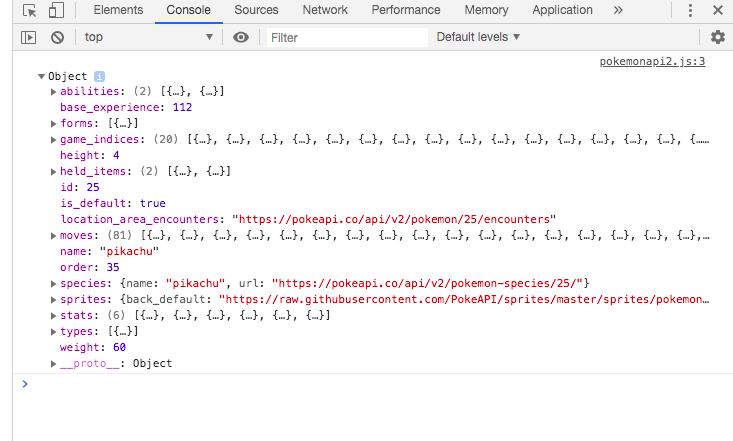
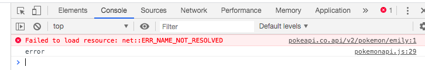

# Notes

* The two main formats that APIs respond with are:
* JSON
* XML

* **JSON** is more commonly used
* Requests can be made in the **browser**
* Requests can be made form the command line using **curl**
* Requests can be made form inside of code 

**Making requests using Node**

* An npm package called **request** can be used

* Install the package
```html
npm install request
```

* Include the package in the code

```html
const request = require('request');
request('http://www.google.com', function(error, response, body) {
if(!error && Response.statusCode == 200) {
  console.log(body)
})
```

* Run node filename to make the request

twitter_request.js

```html
const request = require('request');
request('http://www.twitter.com', function(error, response, body) {
 if(!error && response.statusCode == 200) {
    console.log(body)
  }
})
```
```html
node twiter_request.js
```

Returns: lots of html

An example of a failed request - non-existent page:

sylvanian_families_error_request.js

```html
const request = require('request');
request('https://www.sylvanianfamiliessssss.com/en-uk/', function(error, response, body) {
  if(error) {
      console.log("Server error");
      console.log(error);
  } else {
      if(response.statusCode == 200) {
      console.log(body)
  }
}
})
```
```html
node sylvanian_families_error_request.js
```

Returns: 

```html
Server error
Error: getaddrinfo ENOTFOUND www.sylvanianfamiliessssss.com
    at GetAddrInfoReqWrap.onlookup [as oncomplete] (dns.js:66:26) {
  errno: -3008,
  code: 'ENOTFOUND',
  syscall: 'getaddrinfo',
  hostname: 'www.sylvanianfamiliessssss.com'
}
```

An example using the JSONplaceholder API  - a fake online REST API for testing and prototyping

jsonplaceholder_request.js

```html
request = require('request');

request('https://jsonplaceholder.typicode.com/users/10', function(error, response, body) {
    
    if(!error && response.statusCode == 200) {
        const parsedData = JSON.parse(body); 
        console.log(parsedData);    
    }
})
```

Returns all of the 'person's' data:

```html 
{
      id: 10,
  name: 'Clementina DuBuque',
  username: 'Moriah.Stanton',
  email: 'Rey.Padberg@karina.biz',
  address: {
    street: 'Kattie Turnpike',
    suite: 'Suite 198',
    city: 'Lebsackbury',
    zipcode: '31428-2261',
    geo: { lat: '-38.2386', lng: '57.2232' }
  },
  phone: '024-648-3804',
  website: 'ambrose.net',
  company: {
    name: 'Hoeger LLC',
    catchPhrase: 'Centralized empowering task-force',
    bs: 'target end-to-end models'
  }
}
```

Return specific data by simply accessing the properties:

jsonplaceholder_request2.js

```html
request = require('request');

request('https://jsonplaceholder.typicode.com/users/10', (error, response, body) => {
    
    if(!error && response.statusCode == 200) {
        const parsedData = JSON.parse(body); 
        console.log(parsedData.name + ' lives at ' + parsedData.address.street);
        console.log(parsedData.name + ' works for ' + parsedData.company.name);
        console.log(`${parsedData.name} has a phone number of ${parsedData.phone}`);   
    }
})
```
Returns: 

```html
Clementina DuBuque lives at Kattie Turnpike
Clementina DuBuque works for Hoeger LLC
Clementina DuBuque has a phone number of 024-648-3804
```

* The third console.log() used the ES6 template literal syntax

The fetch syntax can also be used to make requests (uses promises)

```html
fetch(url)
  .then(response => response.json())
  .then(json => console.log(json))
``` 
* **fetch()** - returns a promise
* .then() handlers are used
* If trying to access data - two .then() handlers/callbacks are used
* If the goal is to manipulate data - only one .then() handler is required, although the second can be used 
* fetch() results in the request being made immediately and results in a promise
* if the request is successful - the promise resolves with a built-in reponse object
* then() is used to get the response object
* json() method is used to parse the data because the response object's data is not in JSON format
* the second then() handler - gets the parsed json respresentation of the data

Example of using fetch(), using the Pokemon API:

```html
fetch('https://pokeapi.co/api/v2/pokemon/pikachu')
  .then(response => response.json())
  .then(data => console.log(data));
```

* In the Developer Tools console - the following can be seen:



* Errors should be checked for. An example of a request for a non-existent Pokemon
* Results in an error message

```html
fetch('https://pokeapi.co.api/v2/pokemon/emily')
       .then(data => {
        if(data.ok) {
            console.log("Successful" ) 
        } else {
            console.log("Server error")
        }
    })
    .catch(error => console.log("error"))
           
```

* In the developer tools console - an error is console.logged out




# REST

* REST is an architectual style or design pattern for APIs, created by Roy Fielding
* It is one way to send data over HTTP
* It is considered to be the traditional approach to sending and retrieving data over HTTP
* The newer approach is through the use of GraphQL
* REST stands for Representational State Transfer - meaning that when an API is called, the server transfers a representation of 
the state of the resource to the client
* The representation of the state of the resource can be in JSON format, XML or HTML - most often JSON.
* Resources are the objects that the API can provide information about .e.g a post, a user, a photo
* Each resource has a unique identifier
* A RESTful API is one that adheres to a set of constraints
* A RESTful application allows the client to access and manipulate textual representations of the resources by using
a uniform and predefined set of stateless operations
* A RESTful web application allows the developer to take actions on the resources - the CRUD actions e.g. 
create a new resource, read/show an existing resource, update an existing resource,  delete an existing resource
* When making a call to an API, the developer must provide the following:
- an endpoint - the url for the resource (a unique identifer for the resource)
- an HTTP verb - representing the operation the developer wants the server to perform on that resource e.g.
GET, PUT, PATCH, DELETE, POST

### RESTful constraints

In order for an API to be considered RESTFul, it must adhere to six constraints:

* Stateless
* Uniform interface
* Client - server separation
* Layered system
* Cacheable
* Code on demand

* Stateless - the server doesn't remember anything about the user who is using the API  (doesn't remember any past API calls etc)
Each request contains the information the server needs to perform the request and return a response

* Uniform interface

* The request to the server must include a resource identifier - the url - endpoint
* The response from the server must contain all the information required to modify the resource
* The request must contain all the information the server needs to perform the request

The uniform interface means that requests from different clients look the same


* Client/server separation

The client and server communicate via requests and responses.
* The client (browser) makes a request
* The server is listening for requests and makes an appropriate response 

* Layered system

Between the client and the server wthere could be a multiple servers providing a security layer, a caching layer, a load-balancing layer etc


* Cacheable

The data in the response could be cacheable and contain a version number which is what makes caching possible - informing the client of which version of the data is already has. 

* Code-on-demand

The client can request code from the server, and the response will contain code.


### The limitations of REST

* Multiple requests for related resources

Getting information about a user and the post by that same user can't be combined into one request - it requires two different requests
e.g. two different HTTP GET requests - one to fetch the post object and the other to fetch the user object


* Over fetching/under fetching

It is impossible to fetch very specific data through the use of endpoints e.g.

url.com/books/:id - to get the id
url.com/books/:title - to get the title
url.com/books/:author - to get the author

Making a call to each of these three endpoints will return all the information about that particular books - you can't just fetch the author
or the title. A complete set of data is returned for that particular resource.


