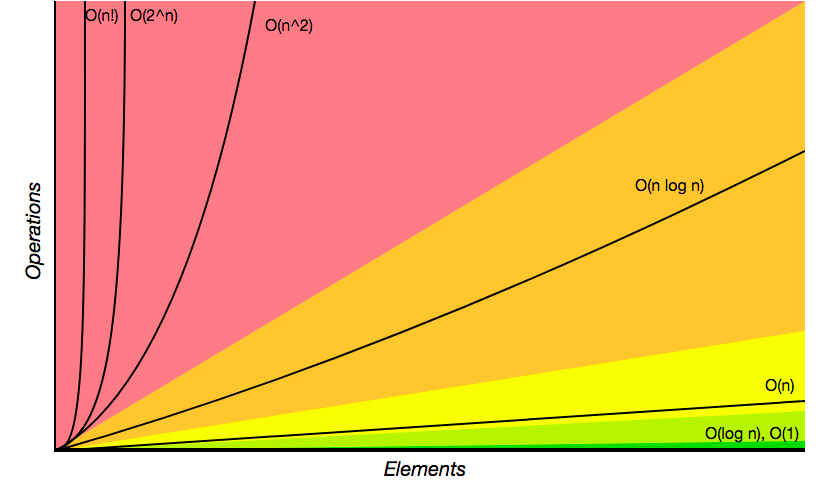

### Algorithms

**What is an algorithm?**

An algorithm is a set of instructions for accomplishing a task

**Defining the 'best' implementation**
What is meant by 'best' in the context of a 'best' implementation?

* Faster
* Less memory intensive
* More readable
* Fewer lines of code

Mostly interested in the first two

* The execution of different implementations can be timed. However, calculating this can be problematic. why?

* Different machines record different times for the same implementation
* The same machine can records different times for the same implementation
* For fast algorithms - speed measurements might not be precise enough 
* Counting operations is better

**Counting operations**

Rather than calculating the time that it takes for the algorithm to execute, the number of simple of operations that a computer has to perform can instead be calculated as this stays constant, in contrast to timing execution, which can be so variable.

Algorithm running times grow at different rates

**Big O Notation**

* Used as a barometer to test the efficiency
* Defines how the runtime of an algorithm grows as the input (n)  grows
* It's about the relationship between the input size and the time relative to that input
* O(n)  - where n is the number of operations

**Visualizing algorithm growth with graphs**

An algorithm is said to take constant time- **O(f(n))** if the number of simple operations the computer has to do is eventually less than a constant timesf(n) as n increases
As n grows - it doesn’t really have an impact, because runtime is always constant
The value of T(n) is bound by a value that does not depend on the size of the input
The algorithm will execute in the same time regardless of the size of the input
Represented by a flat line

An algorithm is said to take linear time if **(fn) = n)** - as n (the input scales - the runtime scales) proportionally, represented by a diagonal, upward sloping line
Its worst case complexity is O(n) - meaning that the greater the input, the more time will be required to execute the code.
Its complexity grows in direct proportion to the size of the input

An algorithm is said to take quadratic time if **(f(n) = n^2**
As n - the input grows - the runtime squares relative to the square of n

An alrogithm is said to take logarithmic time if it runs proportionally to the logarithm of the input size.

An algorithm is said to take exponential time if its growth doubles with each additon to the input  

**Big O notation**:
* provides a numeric representation of code written
* is special notation that tells you how fast an algorithm is
* is a way of comparing code and its performance
* is a system of sorts for classifying code and comparing its performance
* helps you to better understand and be able to talk about your code 
* establishes a worse-case run-time

**Binary search vs. simple search**

Simple search - requires all items to be checked
As the number of items increases, binary search takes a little more time to run, but simple search 
takes a lot more time to run
As the list of numbers gets bigger, binary search suddenly becomes a lot faster than simple search

Simple search - big O of O(n) - linear time
Binary search - big O of O(log n) - can only be run on sorted elements
Needs log n operatios to check a list of size n
Quick sort - big O of O(n * log n) 
Selection sort - big O of 0(n^2) - slow
o(n!) - extremely slow

* Algorithm run times are expressed in Big O notation.
* Algorithm times are measured in terms of growth of an algorithm.
* Algorithm speed isn’t measured in seconds, but by the growth of the number of operations.
* Instead, we talk about how quickly the run time of an algorithm increases as the size of the input increases.
* O(log n) is faster than O(n), but it gets a lot faster as the list of items you’re searching grows.
* O(log n) is faster than O(n), but it gets a lot faster once the list of items you’re searching through grows.

**General rules for analysing complexity** 

1 - Arithmetic operations are constant
The size of the number doesn’t really matter
Whether it’s 5 + 2 or 100000 + 2 = computer takes roughly the same time

2 - Variable assignment is constant
Same time for x = 1000 and x = 1000000

3. Accessing elements in an array using an index or key is constant
- Constant runtime

4. In a loop, the complexity is the length of the loop times the complexity of whatever happens inside of the loop

**Big O complexity chart from Big O cheatsheet:**

 

Graphs 
linear
Quadratic
Exponential
Logarithmic

Which is most efficient