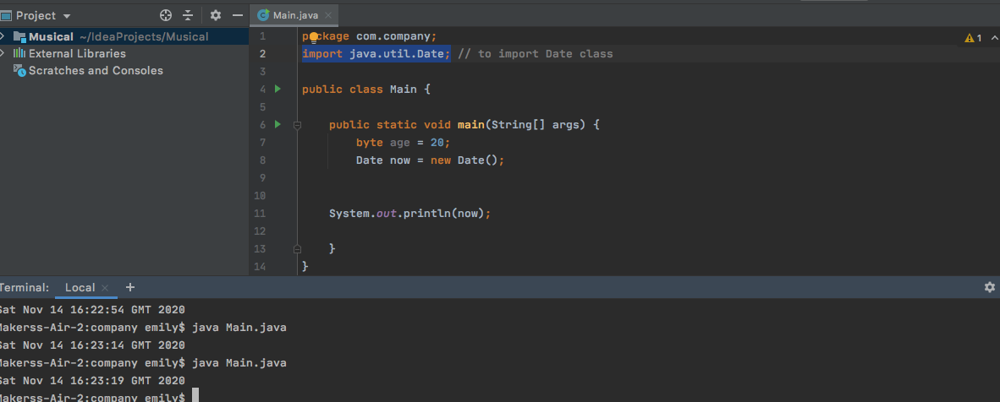
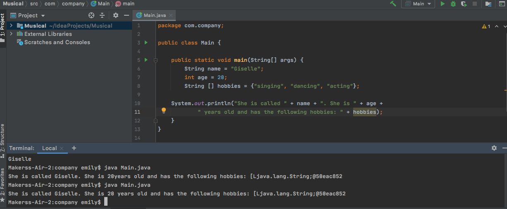
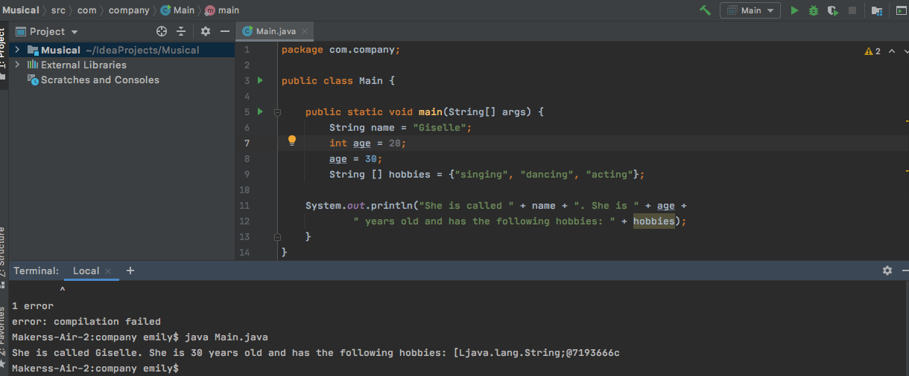
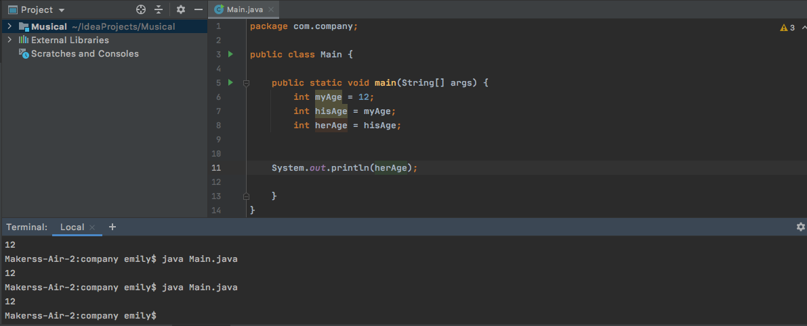
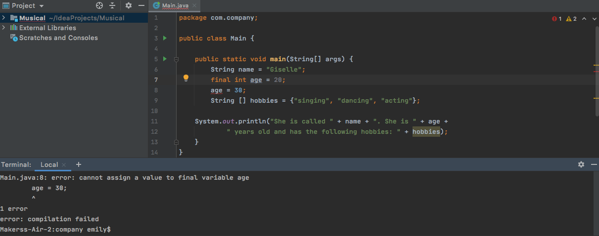
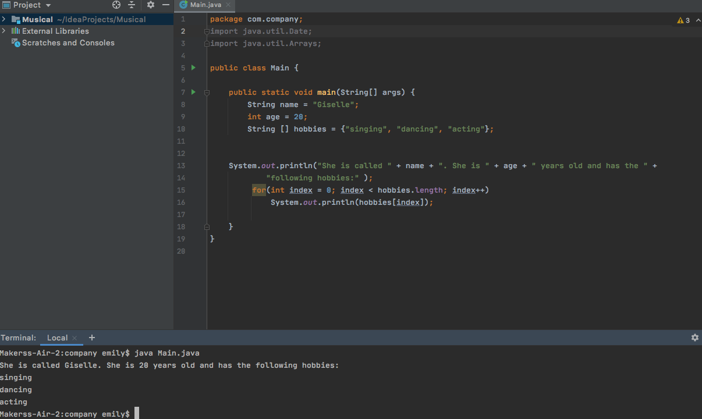

# Java

* Statically-typed object-oriented programming language
* It is a compiled language
* Created in 1995 by James Gosling at Sun Microsystems, which was acquired by Oracle in 2010
* Named after Java Arabica coffee - hence the logo
* Its Virtual Machine ensures the same Java code can be run on different operating systems and platforms, making it platform-independent
* Architecture neutral
* Interpreted
* Multithreaded
* Distributed
* Being a statically-typed langauge - each variable/attribute's type must be declared, unlike in Ruby - which is a dynamically-typed language, and thus doesn't
* Java is also a lower-level language than Ruby and thus is more verbose; it takes more lines of code to achieve the same functionality in Java than it does in Ruby
* A common IDE is IntelliJ
* Java files have the extension .java
* The class is named after the file
* Statements always end with a semicolon - ;
* Java is case-sensitive
* Use pascal case to declare classes
* Use camel case to declare functions and variables
* Every Java program must include a main() method
* Parts of an object can be accessed with a dot - dot notation
* Curly braces are used to indicate the beginning and end of a method and the beginning and end of a class
* Public methods and public classes must be declared with the public keyword - meaning that these are accessibly anywhere in the application

Hello world in Java

```
public class HelloWorld {
  public static void main(String[] args) {
    System.out.println(“Hello World!”);
  }
}
#-> Hello World!
```
In this example:
* static - indicates that the method main() can be called without calling it on an instance of a class
* void is the return value of the method - i.e. this method is expected to have no return value
* the code in the parentheses represents the arguments
* println - shorthand for 'print line'
* Java's way of printing messages to the screen is:
System.out.println() as opposed to simply 'print' in ruby


### Writing comments

* Single-line comments: //
* Multi-line comments: /*    */

### Semicolons

Semicolons are used to mark the end of a statement


# Full compilation cycle:

We can manually compile the Java file with the following command:

```
javac fileName.java
```

If the compilation is unsuccessful - errors are thrown and no fileName.class file is created.
If the compilation is successful - a fileName.class file is created.
This file can be executed with the following command:

```
java fileName.class
```


```
public class Converstion {
  public static void main(String[] args) {
    
    System.out.println(“Hi.”);
    System.out.println(“My name is Emily”);
    System.out.println(“How are you”);

  }
}
```

# Declaring variables

* In Ruby, the type of variable doesn't need to be declared.
* In JavaScript it doesn't either - although let/const/var(ES5) need to prefix the variable name
* In Java, the variable's type must also be declared:

```
public class Human {
	public static void main(String[] args) {
    String name = "Mag";
    int yearOfBirth = 1964;
    System.out.println(name);
	}
}
```

# Primitive Data Types
* Primitive data types are the most simple of data types
* The different primitive data types in Java are:
boolean, long, short, int, double, float, char, byte
* In Java - whole numbers are stored in the int 
* Ints hold pos neg numbers and zero
* Don’t hold floats
* Doubles hold very large numbers and decimals
* Char - a single character. Must be enclosed in single quotes
* Byte - stores whole numbers from -128 to 127
* Primitive data types always have a value
* They start with a lowercase letter
* Primitive types don't have members
* They don't have built-in behaviour

```
public class Attendance{
  public static void main(String[] args) {
    
    double percentageAttendance = 97.4;
    System.out.println(percentageAttendance);
  }
}

#=> 97.4
```

# Non-primitive data types/reference types

The non-primitive data types are:
* strings
* classes
* arrays

They are called reference types because they refer to objects

* Non-primitive data types/ reference types can be null
* They start with an uppercase letter
* Reference types have members
* Reference types have built-in behaviour

* When dealing with reference types, memory must be allocated
* When dealing with primitve types, memory needn't be allocated as memory is allocated and released by the Java Runtime Environment

# Importing classes

To make use of other classes, we can import them.
To import a class use the import keyword e.g.
```
import java.util.Date;
```

to import the Date class



# Scientific numbers

* A floating point number can also be a scientific number with an 'e' to indicate the power of 10:


# Equality

When checking for equality with primitive data types - we can use equality operator
== !=   >=   <=

When checking for equality with non-primitive data types - we can't use the primitive equality operator - have to use the built-in method equals()
e.g.
```

String sentence1 = "Hi there!";
String sentence2 = "Hi!";
System.out.println(sentence1.equals(sentence2));
```


# Naming variables


Variables can only start with a letter or $ - nothing else
Variables should be written using camelcase

;

Variable values can be reassigned:

;

;

If the final keyword is used, the value can't be reassigned - an error will be thrown:

;


# Static checking - helps catch bugs in the code before the code is run e.g

boolean sing 'Get wavy'

# Control flow

if
else if
else

Can also use a ternary operator as you would with JavaScript


# String concatenation

Use the + to concatenate string

# Casting/type conversion

* Two types of casting: widening casting and narrowing casting

* Type casting occurs when value of one primitive data type is assigned to another type

* Widening casting happens automatically - converting a smaller type to a large type size


Order of primitive types from smallest to largest:

boolean -> byte -> short -> char -> int -> float -> long -> double

* Narrowing casting  - converting a larger type to a smaller type. Must be done manually

Order of primitive types from largest to smallest:

double -> long -> float ->  int -> char -> short -> byte -> boolean

The more bytes we have, the greater the number of numbers that can be stored

* byte - takes 1 byte
* boolean - takes 1 byte - 8 bits
* short - takes 2 bytes - 16 bits
* char - takes 2 bytes - 16 bits
* int - takes 4 bytes - 32 bits
* float - takes 4 bytes - 32 bits
* long - takes 8 bytes - 64 bits
* double takes 8 bytes - 64 bits

* When dealing with large numbers - an underscore can be used to separate every three digits
e.g

342_854_930

The correct primitive type should be used, otherwise an error will be thrown e.g. for a number such as 9_342_854_930
if the following was written:
```
short myNumber = 9_342_854_930
```

an error would be thrown.
An error would also be thrown if int were used.
We need to use long instead. However, an L has to be added as a suffix to the number too - otherwise an error will still be thrown:

```

long myNumber = 9_342_854_930L
```
or 
```
long myNumber = 9_342_854_930l
```

Likewise, when dealing with floats - a suffix of F or f needs to be added

# Classes and Objects

In order to have the data types we want, we need to be able to create them, as only a few data types actually exist.
For this purpose, we can define classes, which act as blueprints for the new data structure - defining what the new data structure will look like and what it's made up of.
Classes are used to model more complex pieces of data.
To create the actual data type - we have to instantiate the class.

* To define a class in Java  - use the class keyword
* The class is enclosed within curly braces
* Another term for attributes in Java is fields
* If you don't want a variable to be overwritten, declare it as being final e.g.
```
public class Person
  final String name = "Betty";

  public static void main(String[] args) {
    Person woman = new Person();
    woman.name = "Amy";
    System.out.println(name);
  }
}
```

Will throw an error


# Methods

The keywords static or public can be used with methods

* If the public keyword is used - that method can't be accessed without calling the method
on an instance of the class
* If the static keyword is used - the method can be called without being called on an instance of a class

```
public class Person {
  static void nameThem(String name) {
    System.out.println(fname + "is a teacher");
  }

  public static void main(String[] args) {
    myMethod("Billy");
    myMethod("Benny");
    myMethod("Bathsheba");
  }
}
// Billy is a teacher
// Benny is a teacher
// Bathsheba is a teacher
```

```

public class Student {
 
  
  public void speak() {
    System.out.println("I love music");
  }

  
  public void playInstrument(String instrument) {
    System.out.println("I play the " + instrument);
  }


  public static void main(String[] args) {
    Student student = new Student();     
    student.speak();     
    student.playInstrument('violin);      
  }
}

// I love music
// I play the violin
```


# Constructors

Constructors are called automatically when an instance of a class is created
* All classes have constructors by default
* If one isn't created by the develope, Java creates one

```

public class Person {
  String name; 
  String occupation;

 
  public Person(String name, String occupation) {
    name = "John"; 
    occupation = "developer";
  }

  public static void main(String[] args) {
    Person man = new Person(); // 
    System.out.println(man.name);
    System.out.println(man.occupation);
  }
}

// John
// developer
```

# Some string methods

* length() - returns length of string
* indexOf("h") - returns the index of the specified character
* toUpperCase() - converts the string to a string with upper case letters
* toLowerCase() - converts the string to a string with lower case letters
* replace("h", "i")  - replaces the first character with the second character
* startsWith("k") - 
* endsWith("k") - 


# Java arrays

To define an array of strings:
```
String[] fruit = {"apple", "orange", "banana", "strawberry"};
```

To define an array of integers:
```
int[] numbers = { 1, 2, 3, 4, 5, 6};
```

* Java arrays have a fixed length
* You can't add or remove items to an array
* If items need to be added or removed - a collection class needs to be used

sort() - 

### Printing arrays in Java

Array elements can't be printed directly in Java. Need to import the Arrays class:
```
import java.util.Arrays;
```

Add it to the top of the file

Then use the Arrays.toString method
or use a for loop, as below:

An example:




# Constants

Constants are also known as final variables
* They have a fixed value - can't be changed once set
* Use capital letters
* If a constant must contain multiple words - separate each word with an underscore

# Logical operators

&& - logical and 
|| - logical or
! - not

# Loops

* For loop - used if we know how many times we need to loop

for(int i = 0; i < 10; i++) {
  //
}

* While loop - code is executed for as long as the condition is said to be true

while (condition) {

    if(condition)
      break;
}
 
* Do...while - Code is executed once first and then the condition is checked and the code is run for as long as the condition is said to be true

do {
  
} while (condition);


# For-each loop -  useful for iterating over an array or  collection.

int[] numbers = {10, 2, 30, 4};
for (int number : numbers)

JDK = Java Development Kit

Used to built Java applications
* Contains a compiler, JRE - the Java Runtime Environment and a library of classes
that we use to build applications

# Java editions

* Java SE - Java Standard Edition - core Java platform. Contains libraries
* Java EE - Java Enterprise Edition - used for building large scale distributed systems. Built on top of Java SE and provides additional libraries
* Java EE - Java Micro Edition - subset of Java SE, for mobile device. Provides libraries specific to mobile devices
* Java Card - used in smart cards

# How Java works under the hood

There are two steps involved:
* Compilation
* Execution

During compilation - IntelliJ uses the Java compiler to compile the code into a different format called Java Bytecode
* The Java compiler comes with the Java development kit - jdk
* The Java compiler takes Java code and compiles it down to Java Bytecode which is
a cross-platform format.
* When Java applications are run, JVM is loaded in the memory.
* It takes bytecode as the input and translates it to the native code for the underlying operating system. 
* Main.class is the bytecode representation of the java file - Main.java
* If you are on a Windows machine, the JVM will taketh java bytecode and translate it into code that a Windows machine will understand
* If you are on a Mac, the JVM will take the java bytecode and translate it into code that a Mac machine will understand
This architecture is what makes Java platform independent
* C# and Python have the same architecture

# Writing a Java program

* Open Intellij Idea CE
* Go to new project
* Select Java in side panel on the left
* Select the jdk
* Press next
* Create project from template and select command line app
* Press next
* Give it a name
* Can give it a package name

Package at the top of the Main.java indicates the package that the file belongs to

In Main.java

```
package com.company;

public class Main {

    public static void main(String[] args) {
	System./out/.println(“I like to play the piano”);
    }
}
package com.company;

public class Main {

    public static void main(String[] args) {
	System./out/.println(“I like to play the piano”);
    }
}
```

Press the green play button to test output

To actually compile the code, the Java Virtual Machine must be invoked, using the javac command.

Can be done in two ways

Find where the file is and go to it .e.g

Open the terminal

Cd src
Cd com
cd packageName
Ls

Main.java file is there

Then run
```
javac main.java
```

To invoke the compiler

Now, there should be a Main.class and a Main.java file

Execute the code by running:
```
java Main.java
```

The output will look like this:


The alternative is to go to the src folder and enter the filepath
```
Java com.company.Main
```


