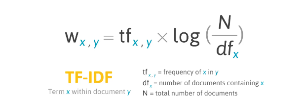

# Notes 

Natural Language Processing(NLP)

* The 'Natural language' in Natural Language Processing - refers to a language that is used for everyday communication e.g. English, French
etc
* NLP can an be described as any kind of computer manipulation of natural language to process, interpret and analyze large amounts of natural language corpora
* Helps to understand a set of abstract rules from text and the relationship that language has with another
* Some examples of technologies that are based on NLP include:  predictive text, machine translation 
* In academia, NLP is commonly known as computational linguistics
* Its roots can be found in Alan Turing's article “Computing Machinery and Intelligence,” - a seminal paper on artificial intelligence.

### NLP Use cases

NLP serves a lot of use cases when dealing with a lot of unstructured data
e.g 
* **sentiment analysis** -  is the extraction of the interpretation or subjective meaning of a word from a document or set of documents to determine the attitude of a specific word or set of words

One of the greatest uses of it is in social media: e.g. Twitter, Facebook, to identify public opinion trends, how often a word appears in a specific tonal context and interpreting the tone of group of words e.g.  analyzing the general sentiment of tweets 
* customer reviews - analyse customers' sentiments about a product through feedback processing
* Spam detection -  to classify emails as spam
* speech recognition
* smart assistants such as Siri, Alexa etc - convert people's words into text, analyze the words
* fake news detection
* document summarization
* autocompletion
* machine translation
* improving accessibility for people with disabilities
* predictive typing

ALthough NLP can be conducted in a range of programming languages e.g.  NLP.js, Natural Wink.js packages can be using with Node.js or JavaScript, Python has the largest number of open-source NLP libraries, of which one is NLTK.

NTLK - the Natural Language Toolkit contains a suite of text processing libraries for classification, stemming, lemmatization, parsing, tokenization, tagging etc

Before carrying out larger NLP tasks, data must be 'cleaned' or 'preprocessed'. Without preprocessing, a computer will interpret “and”, “And”, and “<p>and” as being the same. 
In order to clean the data then, some preprocessing tasks can be used, including:

**Tokenization** - the process of splitting string input into a list of tokens (parts of a word).

(NLTK) provides a method called tokenize() - more specifically word_tokenize() to tokenize words and sent_tokenize() to tokenize sentences
* sent_tokenize  - splits a chunk of text into separate sentences
* word_tokenize  - splits sentences into separate words - or arrays of individual words

**Noise removal** — stripping the text of formatting (e.g. HTML tags)

**Normalisation** - can be split into **text lemmatization and stemming**

The goal of both text lemmatization and stemming is to reduce inflectional forms of a word to a common base form e.g.
```html
am are - be
flower flowers flower's flowers' - flower
```

**Stemming** - the process of removing the inflectional forms of a word or the suffix from a word and reducing it to its root/base word/stem 
e.g flying - suffix is ing - if the suffix is removed, we are left with the stem - fly
```html
Stems stemming stemmed stemmatization are all based on the lemma - stem
```
* Tends to be more crude than lemmatization because oftentimes the deriviational affixes will be removed resulting in a stem that has no meaning e.g. negligen

* Stemmers operate wihtout knowing the context of the word - thus can't understand the difference between words whose meanings depends on their use in the setence/depend on parts of speech
* An example of a stemmer is the Lancaster Stemmer, which we used for ubb

**Lemmatisation** - removes the inflectional endings only and returns the base word - known as a lemma.
Therefore, unlike with stemming - the remaining words has a meaning - less crude
* lemma - is the base form of a word that is used to represent all its other possible forms, the base form under which the word is entered in a dictionary e.g.
run is the lemma - and run runs, running and ran are forms of the same lexeme


With Lemmatization and Stemming, the tokens need to be converted into lowercase characters and the stopwords must be removed. 

some 'words' resulting from stemming = mani hardli arriv
same 'words' after text lemmatization has been carried out = many hardly arrive


**Removing stopwords** - stopwords refer to the most common words in a language, and which don't add much meaning to a sentence. 
* They can be ignored without comprimising the meaning of the sentence i.e. 
```html
is, at, the etc
```

**Lowercasing** - converting all words to lowercase

Once the body of text has been preprocessed, other tasks can be carried out 

**Parsing** -  the analysis of a string of words resulting in a parse tree revealing the syntactic relationships between words which can contain semantics. 
* Concerned with the segmentation of text based on syntax

However, a drawback of parsing is that when and what is parsed is entirely dependent on the user as any paragraph can be phrased any way they choose from individual characters to whole sentences

Parsing can include:


**Parts of speech tagging/ POS tagging**: tagging each word according to its type/ identifying the parts of speech:
run - verb
on - preposition
cat - noun


**Named entity recognition(NER)** = helps to identify the proper nouns in a text e.g. The Tower of London, Jane Fonda, Divergent
Can provide clues as to the topic of the text

**Dependency grammar trees** - help to understand the relationship between the words in a sentence. example of a Python library for this is spaCy 

**Regex parsing** - Python's re library can be used for the purpose of regex parsing. When coupled with POS tagging, you can identify phrase chunks. On its own, it can find you addresses, emails and many other common patterns within large chunks of text


**Language Models**

In order for a computer to be able to make sense of a collection of tokenized words, a language model can be used to train the corpus so that the computer can make predictions about the language

Language models are probabilistic computer models of language that are used to figure out the likelihood that given a sound, letter, word or phrase will be used.
Once a model has been trained, it can be tested out on new texts.
One of the most common language models is the unigram model, a statistical langauge model commonly known as **'bag-of-words'.**

It is a feature extraction technique used to convert text input into vectors of numbers.
Machine learning algorithms can't work with raw text directly - so the text needs to be converted into vectors of numbers.
With ubb - we had to convert the user input(strings) into numerical representation in order for this information to be used.
(Neural networks don't recognize strings)

This conversion of text into vectors of numbers is called **feature extraction**
Outputs the occurrence of each word

“Brown cat”
“white cat"

A feature based on word count:

“Brown cat” => (brown, white, cat) => (1, 0, 1)
“White cat”  -> (brown, white, cat) => (0, 1, 1)

'brown cat' is transformed into a vectorised word count

To use the bag-of-words model, we have to:
* - design a vocabulary of known words - also called tokens
* - choose a measure of the presence of known words

* The structure and order of words is unimportant
* The number of known words can be reduced when using a bag-of-words model to decrease the required memory and computational resources, by using 
some of the above text cleaning techniques e.g. removing stop words, stemming, lemmatization 

Bag-of-words can be thus used to make predictions concerning topics or the overarching sentiment of a text.
It is a good model to use if grammar and word order are irrelevant

**N-Grams and NLM**

If the goal is to conduct language prediction, the n-gram mode - a model that can be used to attention to each word's neighbours, can be used.
Unlike bag-of-words - the n-gram model considers a sequence of some number(n) units and calculates the probability of each unit in a body of language given the preceding sequence of length n


 

Cosine similarity can be used on the vectors to determine similarity


Each document is treated as a vector of features, allowing for mathematical operations such as the cosine similarity to be performed on it

Taking their dot products and dividing it by the multiplication of their magnitudes or other similarity metrics in order to figure out how similar two text documents are

A bag of words can be improved by adjusting the word counts based on their frequency in the corpus 

**TD-IDF**

* Scoring word frequency has its limitations however since the most frequent words in the document can end up with the highest scores, despite them not offering as much information gain to the model.
* One approach is to penalize words that are frequent, using TF-IDF - termm frequency-inverse document frequency
* TD-IDF - is a statistical measure used to evaluate the importance of a word to a document in a corpus

The TF-IDF scoring value increases proportionally to the number of times a word appears in the document, but is offset by the number of documents in the corpus that contain the word.


TF(d, t) = number of occurrences of term t in document d
Inverse document fréquence - importance of the term in the corpus

IDF(t_ = log(D/t) where
D = Total number of documents
T = number of documents with the term


Mathematically, TF-IDF can be expressed as:



We do this so that we can get some sort of word count and also notation on how important a word is relative to the entire corpus


### Natural Language Toolkit - NLTK

installation:
```html

pip install nltk

or
pip3 install nltk

```

