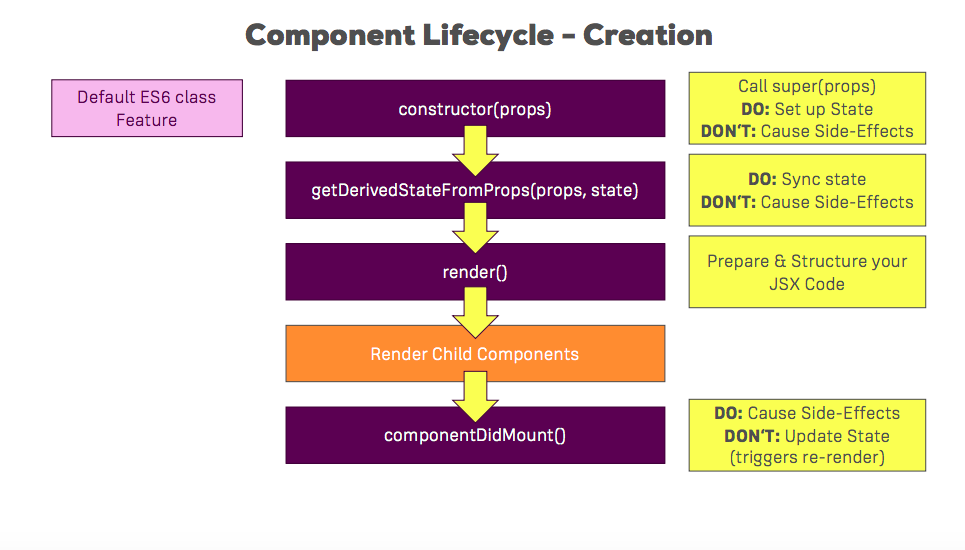
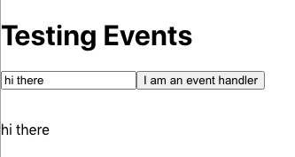
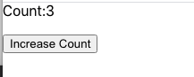

# Notes 

# ## [Intro](#intro) || [JSX](#jsx() || [State](#state) || [Styling](#styling) || [Lifecycle methods](#lifecyclemethods) || [Hooks](#hooks) || [Routing](#routing) || [Fetching Data](#fetchingdata) ||

## Intro
* A core philosophy of React is to split applications into small pieces - separate, lean, reusable components
* Ideally, tasks should be delegated to other components
* There are two types of components - stateful(clever) components and presentational(dumb) components
* The former typically manages state
* The latter tend to have responsibility for styling etc
* It is common to have far more presentational components in a React application than stateful components  

From the React docs:

"Components let you split the UI into independent, reusable pieces, and think about each piece in isolation."


* Rendering content dynamically 

```html
import React from 'react';
import ReactDOM from 'react-dom'


 const App = () => {
   const now = new Date()
   const a = 10
   const b = 20

   console.log('Hello from component')
   return (
   <div>
     <p>Hello world</p>
     <p>
       {a} plus {b} is { a + b }
     </p>
   </div>
   )
 }

export default App;
```

## jsx
**JSX**

* The layout of React components is mostly written using JSX
* The JSX returned by React components is compiled into JavaScript, by Babel
* Projects created using create-react-app are configured to compile automatically 
* It is also possible to write React as "pure JavaScript" without using JSX, but this would take much longer
* JSX is similar to HTML. However, with JSX, dynamic content can be embedded by writing appropriate JS within curly braces
* JSX is 'XML-like' in that every tag must be closed />
* The only place where JavaScript can be written directly (without being embedded in curly braces), is between the render() method and the return statement. You can write pure JS there and save it to a variable. Then refer to this variable at a later point


After compiling, the application looks like this:

```html
import React from 'react'
import ReactDOM from 'react-dom'

const App = () => {
  const now = new Date()
  const a = 10
  const b = 20
  return React.createElement(
    'div',
    null,
    React.createElement(
      'p', null, 'Hello world, it is ', now.toString()
    ),
    React.createElement(
      'p', null, a, ' plus ', b, ' is ', a + b
    )
  )
}

ReactDOM.render(
  React.createElement(App, null),
  document.getElementById('root')
)
```

**Components**

* Components should be capitalized 
* Components should 'end' with 
```html
export default nameOfComponent
```

* Writing components with React is easy, and by combining components, even a more complex application can be kept fairly maintainable. 
Indeed, a core philosophy of React is composing applications from many specialized reusable components.
* Oftentimes, the App component is the 'root' component. Sometimes, however, this is not the case

**props**

* Data can be passed to components using props
* In class-based components, data is referred to using this.props.name. Anytime you refer to a class component within itself, 'this' must be used.
* To access props within a class component, 'this' needs to preface the code you use to access it 
* In functional components, data is referred to using props.name - no use of the 'this' keyword

App.js

```html
import React from 'react';
import ReactDOM from 'react-dom';
import Hello from './Hello';


 const App = () => {

   return (
   <div>
     <p>Hello world</p>
     <Hello name="Emily" />
     <Hello name="Lucy" />
   </div>
   )
 }

export default App;
```

Hello.js

```html
import React from 'react';
import ReactDOM from 'react-dom'


const Hello = (props) => {
    return (
      <div>
        <p>Hello {props.name}</p>
      </div>
    )
    }

export default Hello
```

* In App.js:

```html
import React, { Component } from 'react';
import './App.css';


class App extends Component {
    render() {
      return (
        <div className="App">
          <h1>I am a H1</h1>
          <h3>I am a H3</h3>
          <h5>I am a H5</h5>
          <p>I am a p</p>
          <p>I am also a p</p>
          <h4>I am a H4</h4>
          <ul>
            <li>1.</li>
            <li>2.</li>
          </ul>
        </div>
      ) 
    }
}

export default App;
```

* The above outputs the following in the browser:


### Props continued 


* Props are single values or objects containing a set of values that are passed to components upon creation.


**Uses of Props**

* Pass custom data to components
* Trigger state changes

**Props vs. State**

* State and props are simply JS objects.
* Props get passed to the component
* State is managed within the component 

### Passing props and references to event handlers

**Passing method references between components**

* References to event handlers can be passed e.g. by adding a reference to the event handler - 
changeAnimalsProperties, in each instance of each component as shown below, and then adding
onClick={props.click} to each individual component, each component achieves the same goal as the button - that is to stay that is changes the state - all of the animals' properties are updating whether you click on the button, or on each of Cat, Dog or Rabbit
App.js

```html
render() {
      return (
        <div className="App">
          <button onClick={this.changeAnimalsProperties}>What else do they like to eat?</button>
          <Cat name ={this.state.animals[0].name} 
          age ={this.state.animals[0].age} 
          favouriteFood ={this.state.animals[0].favouriteFood} 
          color="black" 
          click={this.changeAnimalsProperties}
          favouriteNeighbour = "Bob" />
          <Dog name = {this.state.animals[1].name}
           age={this.state.animals[1].age} 
           favouriteFood={this.state.animals[1].favouriteFood}
           click={this.changeAnimalsProperties}
           favouriteHuman = "Tim">Owner: Matilda</Dog>
          <Rabbit name={this.state.animals[2].name} 
          age={this.state.animals[2].age} 
          click={this.changeAnimalsProperties}
          favouriteFood={this.state.animals[2].favouriteFood} />
        </div>
        ```

        Cat.js

        ```html
        import React from 'react';

const cat = (props) => {
    return (
    <div>
        <p onClick={props.click}>My name is {props.name} I am {props.age} years old. I'm a tabby. My favourite food is {props.favouriteFood} I'm super cute. I am {props.color} My favourite neighbour is {props.favouriteNeighbour}</p>
        <p>I am a cat</p>
     </div>
    )
};
  

export default cat;
```
Dog.js and Rabbit.js look the same 


* Creating components
* Components can be class-based or functional

* The following is a class-based component:

```html


import React, {Component} from 'react';

class Photo extends Component {
    render() {
      const post = this.props.post
      return <figure className="captionAndPic">
        
        <figcaption> <p> {post.description} </p> </figcaption>
        <div className="container-button">
          <button className="delete-button">Delete</button>
        </div>
      </figure>
    }
}

 
export default 
```

The same written as a functional component:

```html

import React from 'react';

function Photo(props)
  const post = props.post
      return <figure className="captionAndPic">
        
        <figcaption> <p> {post.description} </p> </figcaption>
        <div className="container-button">
          <button className="delete-button">Delete</button>
        </div>
      </figure>
    }

    export default Photo
```


* The following code shows App.js. Three components - Cat, Dog and Rabbit
have been created and then rendered.

```html
import React, { Component } from 'react';

import Cat from './Cat/Cat'
import Dog from './Dog/Dog'
import Rabbit from './Rabbit/Rabbit'


class App extends Component {
    render() {
      return (
        <div className="App">
          <h1>I am a H1</h1>
          <h3>I am a H3</h3>
          <h5>I am a H5</h5>
          <p>I am a p</p>
          <p>I am also a p</p>
          <h4>I am a H4</h4>
          <ul>
            <li>1.</li>
            <li>2.</li>
          </ul>
          <Cat />
          <Dog />
          <Rabbit />
        </div>
      ) 
    }
}

export default App;

``` 

The above looks like this in the browser:


* **Props**

* **Props** allow the passing of data from a parent component to a child component
* This could be described as passing data down the component tree and triggering 
a re-render
* Props provide access to the attributes we give to our components
* Prop should be passed into individual components as an argument


App.js

```html

import React, { Component } from 'react';

import Cat from './Cat/Cat'
import Dog from './Dog/Dog'
import Rabbit from './Rabbit/Rabbit'


class App extends Component {
    render() {
      return (
        <div className="App">
          <h1>I am a H1</h1>
          <h3>I am a H3</h3>
          <Cat favouriteFood = "fish" color="black" favouriteNeighbour = "Bob" />
          <Dog favouriteHuman = "Tim" />
          <Rabbit />
        </div>
      ) 
    }
}

export default App;

``` 

Cat.js

```html
import React from 'react';

const cat = (props) => {
    return <p>I'm a tabby. My favourite food is {props.favouriteFood} I'm super cute. I am {props.color} My favourite neightbour is {props.favouriteNeighbour}</p>
};
  
export default cat;
```
The above renders as folows:


* **children**

* Children refers to elements that are passed between the opening and closing tags of the 
component. The embedded/nested components

App.js

```html
import React, { Component } from 'react';

import Cat from './Cat/Cat'
import Dog from './Dog/Dog'
import Rabbit from './Rabbit/Rabbit'


class App extends Component {
    render() {
      return (
        <div className="App">
          <h1>I am a H1</h1>
          <h3>I am a H3</h3>
          <Cat favouriteFood = "fish" color="black" favouriteNeighbour = "Bob" />
          <Dog favouriteHuman = "Tim">Owner: Matilda</Dog>
          <Rabbit />
        </div>
      ) 
    }
}

export default App;
```

Dog.js
```html
import React from 'react';

const dog = (props) => {
    return ( 
        <div>
    <p>I'm a terrier. My name is Toby I'm also super cute</p>
    <p>{props.children}</p>
    <h1>{props.children}</h1>
    <h6>{props.children}</h6>
    </div>
    )
};
  
export default dog;
```
The above renders as follows:


## State

* **State** the state of a component is an object that holds some information that may change over the lifetime of the component
* It is used to change the component from within 
* Allows React components to change their output over time in response to user actions, network responses etc.
* State is a property of the Component class
* State is  not accessible to any component other than the one that owns and sets it
* A component's state can be passed down as props to its child components - top-down/unidirectional data flow. 

* It can be accessed via this.state in classical components, which is returned in the
lifecycle method - render() 
* Changes to the state result in an update of the UI - when the state
changes, the component re-renders to reflect the new state in the browser
* With classical components, the only place where you can assign this.state is the constructor

* With functional components, we can use the hook useState() to manage state
* Calling the useState hook returns an array with two values - 
1 - the state itself/the latest state snapshot
2 - the function to change the state - this function allows deve to update the state and tells React that it should re-render. Best to start this method with 'set'
* NB - Any functions that start with 'use' in React are hook functions
* useState only initialises that state when the component is rendered for the first time
* And for subsequent re-render cycles - it just pulls out the latest state snapshot and and ignores the initial value we set

Example of the useState hook in action:
```html
function Radio() {
const [isPlaying, setIsPlaying] = useState(true);
<div className=“radio”>
  The radio is {isPlaying? “Playing” : “not playing”}
<br />
<button onClick={() => setIsPlaying(!isPlaying)}>
  On/Off
</button>
</div>
```

When the button is clicked, the setIsPlaying method is called and changes the state to be the opposite of what it currently is (toggles it)
e.g.
If the radio isn’t playing - it changes it to is playing, and vice versa

The button onClick={() =>  must be wrapped with an arrow function as it delays execution of the method until the button is clicked - the function is only executed when the button is clicked
If we don’t wrap it in an arrow function - the setIsPlaying function will be invoked before the button is even rendered

The setIsPlaying() method does two things: 
1 - changes the state
2 - then it re-renders the component

If you just change the variable directly, React has no way of knowing that it changed, and it won’t re-render
isPlaying is a regular old variable that will go out of scope at the end of the function and any changes to it would be lost
So that’s why it’s important to call the setter, so that React can update the value of that hook’s state behind the scenes


### useEffect hook
```html

React.useEffect(() => {
  axios.get(`https://www.fakeapi.json`)
    .then(res => {
      const newListings = res.data.data.children
      .map(obj => obj.data);
setListings(newListings);
});
}, []);

```
* The useEffect hook gets passed a function.
* useEffect then 'queues up' that function to run after render is done.
* Here, the effect calls axios.get to fetch data from the fake API, which returns a promise,  and the .then handler will get called once the fetch is finished.
The fake Api returns the listings in a  deeply-nested structure, so the res.data.data.children.map... is picking out the individual posts from the nested structure.

Finally, it updates the listings state by calling setListing 


### useEffect Dependency Array


<hr>


App.js
```html

import React, { Component } from 'react';

import Cat from './Cat/Cat'
import Dog from './Dog/Dog'
import Rabbit from './Rabbit/Rabbit'

class App extends Component {
  state = {
    animals: [
      {name: 'Millie', age: 2},
      {name: 'Sally', age: 3},
      {name: 'Clover', age: 4}
    ]
  }
    render() {
      return (
        <div className="App">
          <h1>I am a H1</h1>
          <h3>I am a H3</h3>
          <Cat name ={this.state.animals[0].name} age ={this.state.animals[0].age} favouriteFood = "fish" color="black" favouriteNeighbour = "Bob" />
          <Dog name = {this.state.animals[1].name} age={this.state.animals[1].age} favouriteHuman = "Tim">Owner: Matilda</Dog>
          <Rabbit name={this.state.animals[2].name} age={this.state.animals[2].age} />
        </div>
      ) 
    }
}

export default App;
```
Cat.js

```html
import React from 'react';

const cat = (props) => {
    return <p>My name is {props.name} I am {props.age} years old. I'm a tabby. My favourite food is {props.favouriteFood} I'm super cute. I am {props.color} My favourite neighbour is {props.favouriteNeighbour}</p>
};
  

export default cat;
```

Dog.js
```html
const dog = (props) => {
    return ( 
        <div>
    <p>My name is {props.name} I am {props.age} years old. I'm a terrier. My name is Toby I'm also super cute</p>
    <p>{props.children}</p>
    </div>
    )
};
  
export default dog;
```
Rabbit.js
```html
import React from 'react';


const rabbit = (props) => {
    return <p>My name is {props.name} I am {props.age} years old I'm a dwarf house rabbit. I love carrots</p>
};
  

export default rabbit;
```

The above outputs the following in the browser:


### **More component state**

App.js

```html
import React from 'react';
import Hello from './Hello';

const App = () => {
  const name = 'Marvin'
  const age = 20

  return (
    <div>
      <h1>Greetings</h1>
      <Hello name="Jess" age={16 + 10} />
      <Hello name={name} age={age} />
    </div>
  )
}

export default App;
``` 

Hello.js
```html
import React from 'react';

const Hello = (props) => {
    const yearBorn = () => {
        const yearNow = new Date().getFullYear()
        return yearNow - props.age
    }
  return (
    <div>
      <p>
        Hello {props.name}, you are {props.age} years old
      </p>
      <p>You were born in {yearBorn()}</p>
      </div>
  )
}

export default Hello
```

This outputs the following in the browser:


* The logic for guessing the person's birth year is separated into its own function that is called when the component is rendered.

T* he person's age needn't be passed as a param to the function, since it can directly access all props that are passed to the component.

### **State Manipulation**


* Only two things cause the DOM to be updated:
1. props
2. change of state 

App.js

```html
import React, { Component } from 'react';

import Cat from './Cat/Cat'
import Dog from './Dog/Dog'
import Rabbit from './Rabbit/Rabbit'


class App extends Component {
  state = {
    animals: [
      {name: 'Millie', age: 2, favouriteFood: 'Fish'},
      {name: 'Sally', age: 3, favouritefood: 'Peanut Butter'},
      {name: 'Clover', age: 4, favouriteFood: 'Carrots'}
    ]
  }

  changeFavouriteFood = () => {
  
    this.setState( {
      animals: [
        {name: 'Millie', age: 12, favouriteFood: 'Cabbage'},
        {name: 'Sally', age: 2, favouriteFood: 'Chocolate'},
        {name: 'Clover', age: 11, favouriteFood: 'peppers'}
      ]
    })
  }


    render() {
      return (
        <div className="App">
          <h1>I am a H1</h1>
          <h3>I am a H3</h3>
          <button onClick={this.changeFavouriteFood}>What else do they like to eat?</button>
          <Cat name ={this.state.animals[0].name} age ={this.state.animals[0].age} favouriteFood ={this.state.animals[0].favouriteFood} color="black" favouriteNeighbour = "Bob" />
          <Dog name = {this.state.animals[1].name} age={this.state.animals[1].age} favouriteFood={this.state.animals[1].favouriteFood} favouriteHuman = "Tim">Owner: Matilda</Dog>
          <Rabbit name={this.state.animals[2].name} age={this.state.animals[2].age} favouriteFood={this.state.animals[2].favouriteFood} />
        </div>
      ) 
    }
}

export default App;
```

Cat.js
```html
import React from 'react';

const cat = (props) => {
    return <p>My name is {props.name} I am {props.age} years old. I'm a tabby. My favourite food is {props.favouriteFood} I'm super cute. I am {props.color} My favourite neighbour is {props.favouriteNeighbour}</p>
};
  

export default cat;
```

Dog.js
```html
import React from 'react';

const dog = (props) => {
    return ( 
        <div>
    <p>My name is {props.name} I am {props.age} years old. I'm a terrier. My name is Toby. My favourite food is: {props.favouriteFood}</p>
    <p>{props.children}</p>
    </div>
    )
};
  
export default dog;
```

Rabbit.js
```html
import React from 'react';


const rabbit = (props) => {
    return <p>My name is {props.name} I am {props.age} years old I'm a dwarf house rabbit. My favourite food is {props.favouriteFood} </p>
};
  

export default rabbit;
```
The above renders as follows:

1. Before clicking the button:


2. After clicking the button:


* React merges the old state with the new state
The DOM gets updated because React recognises that the state of the application has changed


### State manipulation with functional components

#### React Hooks
React Hooks are functions that let you “hook into” React state and lifecycle features from functional components. 
* React Hooks typically start with **use** and the most commonly used hook is **useState**
* Needs to be imported into the relevant files, like so: 

```html
import React, { useState } from 'react';
```

* The **useState** hook is the hook that enables state management in functional components
* The initial state is passed to useState()
* useState() returns an array with two elements:
a) the current state value
b) the function that updates that current state value 

### **Array destructuring** facilitates the extraction of elements from the array you get back

* With class-based components, the old state is merged with the new.
* this.setState automatically merges the old state with the new
However, with functional components, this doesn't happen. 
We have to manually copy the old state by using useState as many times as it needed

Example of converting a class-based component into a functional component:

The class-based component:

App.js

```html
import React, { Component } from 'react';

import Cat from './Cat/Cat'
import Dog from './Dog/Dog'
import Rabbit from './Rabbit/Rabbit'


class App extends Component {
  state = {
    animals: [
      {name: 'Millie', age: 2, favouriteFood: 'Fish'},
      {name: 'Sally', age: 3, favouritefood: 'Peanut Butter'},
      {name: 'Clover', age: 4, favouriteFood: 'Carrots'}
    ]
  }

  changeFavouriteFood = () => {
  
    this.setState( {
      animals: [
        {name: 'Millie', age: 12, favouriteFood: 'Cabbage'},
        {name: 'Sally', age: 2, favouriteFood: 'Chocolate'},
        {name: 'Clover', age: 11, favouriteFood: 'peppers'}
      ]
    })
  }

    render() {
      return (
        <div className="App">
          <button onClick={this.changeFavouriteFood}>What else do they like to eat?</button>
          <Cat name ={this.state.animals[0].name} 
            age ={this.state.animals[0].age} 
            favouriteFood ={this.state.animals[0].favouriteFood} 
            color="black" favouriteNeighbour = "Bob" />
          <Dog name = {this.state.animals[1].name} 
          age={this.state.animals[1].age} 
          favouriteFood={this.state.animals[1].favouriteFood} favouriteHuman = "Tim">Owner: Matilda</Dog>
          <Rabbit name={this.state.animals[2].name} 
          age={this.state.animals[2].age} 
          favouriteFood={this.state.animals[2].favouriteFood} />
        </div>
      ) 
    }
}

export default App;
```

Cat.js
```html
import React from 'react';

const cat = (props) => {
    return <p>My name is {props.name} I am {props.age} years old. I'm a tabby. My favourite food is {props.favouriteFood} I'm super cute. I am {props.color} My favourite neighbour is {props.favouriteNeighbour}</p>
};
  

export default cat;
```

Dog.js
```html
import React from 'react';

const dog = (props) => {
    return ( 
        <div>
    <p>My name is {props.name} I am {props.age} years old. I'm a terrier. My name is Toby. My favourite food is: {props.favouriteFood}</p>
    <p>{props.children}</p>
    </div>
    )
};
  
export default dog;
```

Rabbit.js
```html
import React from 'react';


const rabbit = (props) => {
    return <p>My name is {props.name} I am {props.age} years old I'm a dwarf house rabbit. My favourite food is {props.favouriteFood} </p>
};
  

export default rabbit;
```

**The new functional component that has been translated from the class-based component:**

```html
import React, { useState } from 'react';
import './App.css';
import Cat from './Cat/Cat'
import Dog from './Dog/Dog'
import Rabbit from './Rabbit/Rabbit'


const App = props => {
  const [ animalsState, setStateOfAnimals ] = useState({
    animals: [
      {name: 'Millie', age: 2, favouriteFood: 'Fish'},
      {name: 'Sally', age: 3, favouritefood: 'Peanut Butter'},
      {name: 'Clover', age: 4, favouriteFood: 'Carrots'}
    ]
  });

  console.log(animalsState)

  const changeFavouriteFood = () => {
    setStateOfAnimals( {
      animals: [
        {name: 'Millie', age: 12, favouriteFood: 'Cabbage'},
        {name: 'Sally', age: 2, favouriteFood: 'Chocolate'},
        {name: 'Clover', age: 11, favouriteFood: 'peppers'}
      ]
    })
  }
  
      return (
        <div className="App">
          <button onClick={changeFavouriteFood}>What else do they like to eat?</button>
          <Cat name ={animalsState.animals[0].name} 
          age ={animalsState.animals[0].age} 
          favouriteFood ={animalsState.animals[0].favouriteFood} 
          color="black" favouriteNeighbour = "Bob" />
          <Dog name = {animalsState.animals[1].name} 
          age={animalsState.animals[1].age} 
          favouriteFood={animalsState.animals[1].favouriteFood} 
           favouriteHuman = "Tim">Owner: Matilda</Dog>
          <Rabbit name={animalsState.animals[2].name} age={animalsState.animals[2].age} favouriteFood={animalsState.animals[2].favouriteFood} />
        </div>
      ) 
      }

export default App;
```
### Stateful vs. stateless components

* **Stateful components** - manage state, whether that be through React Hooks (functional components), or by using the state property and setState() (class-based components)
* Also known as 'smart' or 'container' components

* **Stateless components** - don't manage state.
* Also know as 'dumb' or 'presentational components'

An example of a stateless component:

```html

import React from 'react';

const cat = (props) => {
    return <p>My name is {props.name} I am {props.age} years old. I'm a tabby. My favourite food is {props.favouriteFood} I'm super cute. I am {props.color} My favourite neighbour is {props.favouriteNeighbour}</p>
};
  

export default cat;
```
* The focus should be on making stateless components, for the most part, and only creating
one or two stateful components, depending on the size of the application. 


### **Passing arguments**

* Arguments can be passed using bind() e.g.

Code omitted for the sake of brevity 

```html
class App extends Component {
 state = { 
    animals: [
      {name: 'Milly', age: 2, favouriteFood: 'Fish'},
      {name: 'Sally', age: 3, favouritefood: 'Peanut Butter'},
      {name: 'Clover', age: 4, favouriteFood: 'Carrots'}
    ]
  }

  changeAnimalsProperties = (newName) => {
  
    this.setState( {
      animals: [
        {name: newName, age: 12, favouriteFood: 'Cabbage'},
        {name: 'Sally', age: 2, favouriteFood: 'Chocolate'},
        {name: 'Clover', age: 11, favouriteFood: 'peppers'}
      ]
    })
  }

    render() {
      return (
        <div className="App">
          <button onClick={this.changeAnimalsProperties.bind(this, "Lulu")}>What else do they like to eat?</button>
          <Cat name ={this.state.animals[0].name} 
          age ={this.state.animals[0].age} 

  ```
* newName is passed in as an arg to changeAnimalsProperties
* This data is passed using bind()
```html
<button onClick{this.changeAnimalsProperties.bind(this, "Lulu")}>

In the Cat component (Cat.js) 
```html
import React from 'react';

const cat = (props) => {
    return (
    <div>
        <p onClick={props.click}>My name is {props.name} I am {props.age} years old. I'm a tabby. My favourite food is {props.favouriteFood} I'm super cute. I am {props.color} My favourite neighbour is {props.favouriteNeighbour}</p>
        <p>I am a cat</p>
     </div>
    )
};

export default cat;
```

* When the button is clicked - the cat's name changes from Milly to Lulu - the new value
(newName)

* **Two-way binding and dynamic updates**

We can dynamically change the names of the different animals in the browser by entering a new new into the relevant text box

The following shows how we can change the name of the cat, in the browser


The following shows how we can change the name of the dog, in the browser

The following shows how we can change the name of the rabbit, in the browser


**How was this achieved?**

* The event handler - onChange was used. (onChange is fired whenever the input value changes)
* Three new methods were created: 
```html
changeNameDynamicallyCat()
changeNameDynamicallyDog()
changeNameDynamicallyRabbit()
```

all three of which update the state.

* These methods were passed an event object, each of which have a target - the input boxes in the respective components.
* Each target also has a value - which is the value entered into the text box(target)
* We bind onChange to the changed props in each component - each of which hold a reference to their respective event handler
* The default event object extracts the target 
* We utilize two-way binding by adding value={props.name}
to each component, so that the initial value is shown in the input box, before we start to change its value
* All in all, the state is updated, the props are updated and hence the changes in the input are reflected in the browser.


* The code for App.js, Cat.js, Dog.js and Rabbit.js:

App.js
```html
import React, { Component } from 'react';
import './App.css';
import Cat from './Cat/Cat'
import Dog from './Dog/Dog'
import Rabbit from './Rabbit/Rabbit'


class App extends Component {
 state = { 
    animals: [
      {name: 'Millie', age: 2, favouriteFood: 'Fish'},
      {name: 'Sally', age: 3, favouritefood: 'Peanut Butter'},
      {name: 'Clover', age: 4, favouriteFood: 'Carrots'}
    ]
  }

  changeAnimalsProperties = (newName) => {
  
    this.setState( {
      animals: [
        {name: newName, age: 12, favouriteFood: 'Cabbage'},
        {name: 'Sally', age: 2, favouriteFood: 'Chocolate'},
        {name: 'Clover', age: 11, favouriteFood: 'peppers'}
      ]
    })
  }

  changeNameDynamicallyCat = (event) => {
    this.setState( {
      animals: [
        { name: event.target.value, age: 12, favouriteFood: 'Cabbage'},
        { name: 'Sally', age: 2, favouriteFood: 'Chocolate'},
        { name: 'Clover', age: 11, favouriteFood: 'peppers'}
      ]
    })
  }

  changeNameDynamicallyRabbit= (event) => {
    this.setState( {
      animals: [
        { name: "Millie", age: 12, favouriteFood: 'Cabbage'},
        { name: 'Sally', age: 2, favouriteFood: 'Chocolate'},
        { name: event.target.value, age: 11, favouriteFood: 'peppers'}
      ]
    })
  }

  changeNameDynamicallyDog= (event) => {
    this.setState( {
      animals: [
        { name: "Millie", age: 12, favouriteFood: 'Cabbage'},
        { name: event.target.value, age: 2, favouriteFood: 'Chocolate'},
        { name: 'Clover', age: 11, favouriteFood: 'peppers'}
      ]
    })
  }

    render() {
      return (
        <div className="App">
          <button onClick={this.changeAnimalsProperties}>What else do they like to eat?</button>
          <Cat name ={this.state.animals[0].name} 
          age ={this.state.animals[0].age} 
          favouriteFood ={this.state.animals[0].favouriteFood} 
          color="black" 
          click={this.changeAnimalsProperties}
          changed={this.changeNameDynamicallyCat}
          favouriteNeighbour = "Bob" />
          <Dog name = {this.state.animals[1].name}
           age={this.state.animals[1].age} 
           favouriteFood={this.state.animals[1].favouriteFood}
           click={this.changeAnimalsProperties}
           changed={this.changeNameDynamicallyDog}
           favouriteHuman = "Tim">Owner: Matilda</Dog>
          <Rabbit name={this.state.animals[2].name} 
          age={this.state.animals[2].age} 
          click={this.changeAnimalsProperties}
          favouriteFood={this.state.animals[2].favouriteFood}
          changed={this.changeNameDynamicallyRabbit} />
        </div>
      ) 
    }
}

export default App;
```

Cat.js
```html
import React from 'react';

const cat = (props) => {
    return (
    <div>
        <p onClick={props.click}>My name is {props.name} I am {props.age} years old. I'm a tabby. My favourite food is {props.favouriteFood} I'm super cute. I am {props.color} My favourite neighbour is {props.favouriteNeighbour}</p>
        <p>I am a cat</p>
        <input type="text" onChange={props.changed} value = {props.name}/>
     </div>
    )
};
  

export default cat;
```
Dog.js
```html
const dog = (props) => {
    return ( 
        <div>
    <p onClick={props.click}>My name is {props.name} I am {props.age} years old. I'm a terrier. My name is Toby. My favourite food is: {props.favouriteFood}</p>
    <p>{props.children}</p>
    <input type="text" onChange={props.changed} value={props.name}/>
    </div>
    )
};
  
export default dog;
```

Rabbit.js
```html
import React from 'react';


const rabbit = (props) => {
    return (
    <div>
    <p onClick={props.click}>My name is {props.name} I am {props.age} years old I'm a dwarf house rabbit. My favourite food is {props.favouriteFood} </p>
<input type="text" onChange={props.changed} value={props.name}/>
</div>
    )
};
  
export default rabbit;
```

### Styling React Applications

* There are different ways to style React components
* 1 - Use stylesheets
* 2 - Use inline styling
* 3 - Use  variables 
* 4 - Use functions - for dynamic styling - i.e. the style changes when certain things happen e.g. a button is clicked 

### * **Stylesheets**

* The important thing to remember is to import the .css file into the component file e.g.
I created a Dog.css file, so in my Dog.js file, I had to add the following:

```html
import './Dog.css';
```

I did the same for the Rabbit and Cat components.

The following shows three differently styled components, although the styling is not something I'd want to use in 'real' code:


### **Inline Styling**

* Inline styling can also be used.
* To style an element with the inline style attribute, the value must be a JavaScript object
* Since the inline CSS is written in a JavaScript object, properties such as background-color, which normally utilize a -, must be written with camel case syntax e.g.
backgroundColor
* When using inline styling, we need to use double curly braces {{ }}

### **Styling with variables**

Other code ommitted for brevity:

```html
render() {

      const style = {
        backgroundColor: '#e6ffff',
        font: 'inherit',
        border: '6px solid #e6ccff',
        padding: '10px'
      }

      return (
        <div className="App">
          <button style={style} onClick={this.changeAnimalsProperties}>What else do they like to eat?</button>
          <Cat name ={this.state.animals[0].name} 
          age ={this.state.animals[0].age} 
  ```
  The above button looks like this:


A comparison of inline styling and use of variables to style components:

**Inline styling**
```html


<div style={{backgroundColor: ‘pink’ }}>
  <p>{this.props.todo.title}</p>
</div>
```

**Styling using variables**

```html

const styling = {
backgroundColor: ‘pink’
}

<div style={styling}>
  <p>{this.props.todo.title}</p>
</div>

```

### **Dynamic styling using functions**

* Possible use case - a todo list. If an item has been completed i.e the user has checked the checkbox, we might want to see a line through the completed item.
* This can be achieved using functions

```html

getStyle = () => {
  if(this.props.todo.completed){

    return { 
      textDecoration: ‘line-through’
  } else {
    return {
      textDecoration: ‘none’
  }  
}

render()
  return() {
    <div style={this.getStyle()}>
      <p>{ this.props.todo.title }</p>
    </div> 
}

```

With the above, if items have a completed status of true - a line will appear through them (once the user has checked the checkbox) - otherwise, the todo items don't have a line through them.

### Material UI

Another option is to use Material UI. Material UI is similar to BootStrap but it is a little more sophisticated and better suited to React applications.

* To install Material UI:

```html
npm install —save @material-ui/core
```
* To use Material UI in an application:

```html
import React from ‘react’;
import { Button } from ‘@material-ui/core’;

function App() {
  return <Button color=“primary”>Hello World</Button>;
}
```

Whichever component/components you want to use need to be imported at the top

* <Typography></Typography> component is used for text

### Radium

Radium is a useful package that enables developers to make use of pseudoselectors and media queries with inline styles.
Without using Radium, these can't be used in the context of inline styling.

The package needs to be installed:

```html
npm install radium --save
```
It needs to be imported into the file in which it is to be used:
```html
import Radium form 'radium';
```

Radium needs to wrap the component in the export:
```html
export default Radium(App);
```

* Radium now provides extra functionality to the App component.
* It can be used with both functional and classical components.

##### Radium and media queries

An extra StyleRoot component needs to be added when using Radium for the purpose of using media queries with inline styles:

```html
import Radium, { StyleRoot } from 'radium';
```

Everything in the return statement then has to be wrapped in this StyleRoot component:
```html
return (
      <StyleRoot>
      <div className="App">
        <h1>Test</h1>
        <p className={classes.join(' ')}>Still testing</p>
        <button
          style={style}
          onClick={this.toggleName}>Toggle Name</button>
        {characters}
      </div>
      </StyleRoot>
    );
  ```
  <hr>

  ### Styled Components

  Styled components can be used for the purpose of styling
  The styled components library needs to be installed:
  ```html
  npm install --saved styled-components"
  ```

  Needs to be imported into the specific files:
  ```html
  import styled from 'styled-components'
  ```

  The styled object has a method for every html element that exists e.g. .div 
  .h1 .p  etc
  These methods when called don't utilize the usual parentheses (), rather they use two backticks ``

  ```html
  import React from 'react';
  import styled from 'styled-components';

  const StyledDiv = styled.div`
    width: 60%;
              margin: 16px auto;
              border: 1px solid blue;
              box-shadow: 0 2px 3px;
              padding: 16px;
              text-align: center;

}
`;

const Person = (props) => {

    const style = {
        '@media (min-width: 500px)': {
            width: '450px'
        }

    };

    return (
     
        <div>
         <StyledDiv>
        <h1 onClick={props.click}>I am called {props.name}</h1>
        <h2>I am {props.age} years old</h2>
        {props.children}
        <input type="text" onChange={props.changed} value={props.name}></input>
        </StyledDiv>
        </div>
    )
}


export default Person;
  ```

The result of called the div() method on the styled object is stored in the variable called
StyledDiv ----  const StyledDiv


### **Conditionals and conditional rendering**

* Output can be rendered conditionally, e.g. we can choose to hide or chose specific content.
One way of achieving this is to use a ternary operator ( a default JS construct) and adding a property to the state.
* In the initial state, I create a property called showAnimals and set it to false, so that the animals are hidden by default.
* In order to render the animals upon a click of the button, the following must be done:
* Create an event handler e.g.

```html
showHideAnimals = () => {
  const showing = this.state.showAnimals;
  this.setState({showAnimals: !showing});
}
```
Save the current state to a variable and then update the state using setState() show that when showing is true - we set the showAnimals property to false and if showing is false, we set the showAnimals property to true

* Use the ternary operator and wrap the content in a div

```html
{ 
          this.state.showAnimals   === true ?
          <div>
          <Cat name ={this.state.animals[0].name} 
          age ={this.state.animals[0].age} 
          favouriteFood ={this.state.animals[0].favouriteFood} 
          color="black" 
          click={this.changeAnimalsProperties}
          changed={this.changeNameDynamicallyCat}
          favouriteNeighbour = "Bob" />
          <Dog name = {this.state.animals[1].name}
           age={this.state.animals[1].age} 
           favouriteFood={this.state.animals[1].favouriteFood}
           click={this.changeAnimalsProperties}
           changed={this.changeNameDynamicallyDog}
           favouriteHuman = "Tim">Owner: Matilda</Dog>
          <Rabbit name={this.state.animals[2].name} 
          age={this.state.animals[2].age} 
          click={this.changeAnimalsProperties}
          favouriteFood={this.state.animals[2].favouriteFood}
          changed={this.changeNameDynamicallyRabbit} />
          </div> : null
    }
    </div>
    ```

The whole file (App.js) would look like this:

```html
import React, { Component } from 'react';
import './App.css';
import Cat from './Cat/Cat'
import Dog from './Dog/Dog'
import Rabbit from './Rabbit/Rabbit'


class App extends Component {
 state = { 
    animals: [
      {name: 'Millie', age: 2, favouriteFood: 'Fish'},
      {name: 'Sally', age: 3, favouritefood: 'Peanut Butter'},
      {name: 'Clover', age: 4, favouriteFood: 'Carrots'}
    ],
    showAnimals: false
  }

  changeAnimalsProperties = (newName) => {
  
    this.setState( {
      animals: [
        {name: newName, age: 12, favouriteFood: 'Cabbage'},
        {name: 'Sally', age: 2, favouriteFood: 'Chocolate'},
        {name: 'Clover', age: 11, favouriteFood: 'peppers'}
      ]
    })
  }

  changeNameDynamicallyCat = (event) => {
    this.setState( {
      animals: [
        { name: event.target.value, age: 12, favouriteFood: 'Cabbage'},
        { name: 'Sally', age: 2, favouriteFood: 'Chocolate'},
        { name: 'Clover', age: 11, favouriteFood: 'peppers'}
      ]
    })
  }

  changeNameDynamicallyRabbit= (event) => {
    this.setState( {
      animals: [
        { name: "Millie", age: 12, favouriteFood: 'Cabbage'},
        { name: 'Sally', age: 2, favouriteFood: 'Chocolate'},
        { name: event.target.value, age: 11, favouriteFood: 'peppers'}
      ]
    })
  }

  changeNameDynamicallyDog= (event) => {
    this.setState( {
      animals: [
        { name: "Millie", age: 12, favouriteFood: 'Cabbage'},
        { name: event.target.value, age: 2, favouriteFood: 'Chocolate'},
        { name: 'Clover', age: 11, favouriteFood: 'peppers'}
      ]
    })
  }


  showHideAnimals = () => {
    const doesshow = this.state.showAnimals;
    this.setState({showAnimals: !doesshow});
  }

    render() {
      const style = {
        backgroundColor: '#e6ffff',
        font: 'inherit',
        border: '6px solid #e6ccff',
        padding: '10px'
      }

      return (
          <div className="App">
          <button style={style} onClick={this.showHideAnimals}>What else do they like to eat?</button>
          { 
          this.state.showAnimals   === true ?
          <div>
          <Cat name ={this.state.animals[0].name} 
          age ={this.state.animals[0].age} 
          favouriteFood ={this.state.animals[0].favouriteFood} 
          color="black" 
          click={this.changeAnimalsProperties}
          changed={this.changeNameDynamicallyCat}
          favouriteNeighbour = "Bob" />
          <Dog name = {this.state.animals[1].name}
           age={this.state.animals[1].age} 
           favouriteFood={this.state.animals[1].favouriteFood}
           click={this.changeAnimalsProperties}
           changed={this.changeNameDynamicallyDog}
           favouriteHuman = "Tim">Owner: Matilda</Dog>
          <Rabbit name={this.state.animals[2].name} 
          age={this.state.animals[2].age} 
          click={this.changeAnimalsProperties}
          favouriteFood={this.state.animals[2].favouriteFood}
          changed={this.changeNameDynamicallyRabbit} />
          </div> : null
    }
    </div>
      ) 
    }
}


export default App;
```

Now, when we click the button, the content is rendered, when we click the button again, the content disappears.

* An alternative (perhaps neater) way to achieve the above is to do the following:

* Create a variable and place between the render() and return statement

```html
let animals = null;

if(this.state.showAnimals) {


}
```

So, by default animals is null


```html
import React, { Component } from 'react';
import './App.css';
import Cat from './Cat/Cat'
import Dog from './Dog/Dog'
import Rabbit from './Rabbit/Rabbit'


class App extends Component {
 state = { 
    animals: [
      {name: 'Millie', age: 2, favouriteFood: 'Fish'},
      {name: 'Sally', age: 3, favouritefood: 'Peanut Butter'},
      {name: 'Clover', age: 4, favouriteFood: 'Carrots'}
    ],
    showAnimals: false
  }

  changeAnimalsProperties = (newName) => {
  
    this.setState( {
      animals: [
        {name: newName, age: 12, favouriteFood: 'Cabbage'},
        {name: 'Sally', age: 2, favouriteFood: 'Chocolate'},
        {name: 'Clover', age: 11, favouriteFood: 'peppers'}
      ]
    })
  }

  changeNameDynamicallyCat = (event) => {
    this.setState( {
      animals: [
        { name: event.target.value, age: 12, favouriteFood: 'Cabbage'},
        { name: 'Sally', age: 2, favouriteFood: 'Chocolate'},
        { name: 'Clover', age: 11, favouriteFood: 'peppers'}
      ]
    })
  }

  changeNameDynamicallyRabbit= (event) => {
    this.setState( {
      animals: [
        { name: "Millie", age: 12, favouriteFood: 'Cabbage'},
        { name: 'Sally', age: 2, favouriteFood: 'Chocolate'},
        { name: event.target.value, age: 11, favouriteFood: 'peppers'}
      ]
    })
  }

  changeNameDynamicallyDog= (event) => {
    this.setState( {
      animals: [
        { name: "Millie", age: 12, favouriteFood: 'Cabbage'},
        { name: event.target.value, age: 2, favouriteFood: 'Chocolate'},
        { name: 'Clover', age: 11, favouriteFood: 'peppers'}
      ]
    })
  }


  showHideAnimals = () => {
    const doesshow = this.state.showAnimals;
    this.setState({showAnimals: !doesshow});
  }

    render() {
      const style = {
        backgroundColor: '#e6ffff',
        font: 'inherit',
        border: '6px solid #e6ccff',
        padding: '10px'
      }
      
      let animals = null;
      
      if(this.state.showAnimals) {
        animals = (
        <div>
          <Cat 
          name ={this.state.animals[0].name} 
          age ={this.state.animals[0].age} 
          favouriteFood ={this.state.animals[0].favouriteFood} 
          color="black" 
          click={this.changeAnimalsProperties}
          changed={this.changeNameDynamicallyCat}
          favouriteNeighbour = "Bob" />
          <Dog 
          name = {this.state.animals[1].name}
           age={this.state.animals[1].age} 
           favouriteFood={this.state.animals[1].favouriteFood}
           click={this.changeAnimalsProperties}
           changed={this.changeNameDynamicallyDog}
           favouriteHuman = "Tim">Owner: Matilda</Dog>
          <Rabbit 
          name={this.state.animals[2].name} 
          age={this.state.animals[2].age} 
          click={this.changeAnimalsProperties}
          favouriteFood={this.state.animals[2].favouriteFood}
          changed={this.changeNameDynamicallyRabbit} /> 
          </div>
          )
      }

      return (
          <div className="App">
            <button style={style} onClick={this.showHideAnimals}>What else do they like to eat?</button>
            {animals}      
          </div>
      ) 
    }
}


export default App;
```
* When the button is clicked, the content is rendered, when the button is clicked again, the content is hidden. 

More conditional rendering (example taken from the React docs):

```html
class LoginControl extends React.Component {
  constructor(props) {
    super(props);
    this.handleLoginClick = this.handleLoginClick.bind(this);
    this.handleLogoutClick = this.handleLogoutClick.bind(this);
    this.state = {isLoggedIn: false};
  }

  handleLoginClick() {
    this.setState({isLoggedIn: true});
  }

  handleLogoutClick() {
    this.setState({isLoggedIn: false});
  }

  render() {
    const isLoggedIn = this.state.isLoggedIn;
    let button;
    if (isLoggedIn) {
      button = <LogoutButton onClick={this.handleLogoutClick} />;
    } else {
      button = <LoginButton onClick={this.handleLoginClick} />;
    }

    return (
      <div>
        <Greeting isLoggedIn={isLoggedIn} />
        {button}
      </div>
    );
  }
}
```

### **Lists**

```html
{this.state.animals.map(animal => {
            return <Cat name={cat.name} age={cat.age} favouriteFood = {cat.favouriteFood} />
          })}
```

* We map through the array of JS objects and a new array is produced, which constains JSX elements.
* We are essentially converts an array of JS objects into an array of JSX objects, apart from the fact that map() is NOT a destructive method and doens't modify the original array - just returns a new one.
* These new JSX elements are rendered to the DOM

**Using the map() method**

When using map() with React - each item you’re mapping over needs to be given a key prop
Often this will be an id

<hr>

## Lifecycle methods

### **The lifecycle of a component and lifecycle methods**

* Components have a lifecycle. This lifecycle is composed of three phases:
* Mounting - 'birth' of component
* Updating - 'growth' of component
* Unmounting - 'death' of component

**Lifecycle Methods**

* React components also have several methods that provide opportunities to perform actions at specific points in a component's lifecycle. 
* They let you define pieces of code you want to execute according to the state of the component like mounting, rendering, updating and un-mounting.

### Mounting/creation phase

* In the mounting phase - four lifecycle methods can be called, of which the only obligatory one is render(), which is
responsible for rendering 

The other three are :
* constructor()
* getDerivedStateFromProps
(render())
* componentDidMount()

**render()**
* render() is a pure function, i.e. one that has no side effects. Pure functions should NEVER modify state, so the use of 
this.setState() should never be placed in the render() method

**componentDidMount()**

* componentDidMount() is called after a component is mounted to the DOM.
* Any use of the setState() method here will trigger a re-rendering of the component

* componentDidMount() is a good place to put API calls, calls to a server and/or add event listeners
* State can be modified in componentDidMount() - for the purpose of modals, tooltips etc, but the best place to modify
state is in the constructor
* When componentDidMount() is used to make calls to an API with async ....await, the async needs to be placed IN FRONT of componentDidMount(), rather than after it e.g.

```html
 async componentDidMount() {
      const fetchedData = await fetchData();

      this.setState({ data: fetchedData });

  }
```

versus

```html
const fetchData = async () => {
```


**constructor**

* constructor() is called before anything else, when the component is created.
* This is where initial state and other initial values should be placed
* constructor() is called with props as arguments and props should also be passed to the super() method
* This will initiate the parent's constructor method and allow the component to inherit methods from its parent

**getDerivedStateFromProps** - is called just before the elements are rendered in the DOM

getDerivedStateFromProps()
After the constructor() runs - getDerivedStateFromProps() is executed. The idea is that whenever the props change - you can sink your state to them. This lifecycle hook isn't used a lot.                   
Furthermore, side effects shouldn't be caused in this lifecycle hook.




### Update phase - component update lifecycle

This stage occurs when the state changes or when props change - which trigger a re-render

The Update lifecycle begins with the execution of the getDerivedStateFromProps() lifecycle hook

##### getDerivedStateFromProps(props, state)


##### shouldComponentUpdate
Then the shouldComponentUpdate(nextProps, nextState) lifecycle hook is executed


##### shouldComponentUpdate()
The shouldComponentUpdate() lifecycle hook allows you to cancel the updating process

* Here you can decide whether you want React to continue evaluating and re-rendering the component - for the purpose of performance optimization
* Powerful because it allows you to prevent unnecessary update cycles

### render()
Then the render() method is called - it constructs the virtual DOM for the developer and checks whether it needs to update the real DOM

React then updates all the child components of this component.

### getSnapshotBeforeUpdate()
Then the getSnapshotBeforeUpdate() lifecycle hook is executed

This takes the previous props and previous state as arguments and returns a snapshot object. 
It is something of a niche hook  - not used that often. Used for last-minute DOM operations e.g. getting the current scrolling position of the user. Returns a snapshot of these previous props and state


### componentDidUpdate()
Then componentDidUpate() is called. This signals that the updating is finished. Here, side effects are permitted.

componentDidUpdate() should not be called synchronously

  


<hr>

### **Handling events and event handlers**

* We can add event handlers to any element by adding onNameOfEvent e.g. onClick
onSubmit - for forms
* Pointers to functions/references to functions can be passed to the event listeners
* Event Handlers are the names of the functions which we reference - and it is best practice to add 
'Handler' to the name of these event handlers
* Event handlers are triggered when the event occurs e.g. a button is clicked, a page is loaded etc

**onClick** 
**onChange** - are both handlers that can be added to elements. When the event occurs, e.g. a button is clicked, the method that has been defined will be executed e.g.
```html
<button onClick = "sayHello()">Click to say Hi</button>
```
upon clicking said button, the sayHello() method is executed 

In vanilla JavaScript - the onclick attribute is written without the capital c, as it is in React

``html
<button onclick="SayGoodbye()">Click to say Bye</button>
```

**Event handlers/event listeners** - methods that are executed in response to events. Events could be anything from a mouse click, a page stroll, to a keystroke or a mouse hover.

**event.target** - 
- target is an event property which is used to get or 'target' the element on which the event originally occurred - returns the element that triggered the event.

### **Methods**

Methods can be assigned to objects even after the creation of the object: 

```
person = {
  name: 'Jonanthan SacconeJoly',
  age: 40,
  nationality: 'Irish,
  greet: function() {
    console.log('hello, my name is ' + this.name)
  },
}

person.growOlder = function() {
  this.age += 1
}

console.log(arto.age)   // 41 is printed
arto.growOlder()
console.log(arto.age)   // 42 is printed

```

With React, functional programming techniques are often used.
Once characteristic of functional programming is the use of immutable data structures e.g.
concat()

* **concat()** doesn't add an item to an array - it creates a new array with the old and the new array combined e.g.
```html
const t = [1, -1, 3]
const t2 = t.concat(5)
console.log(t) // [1, -1, 3]
console.log(t2) // [1, -1, 3, 5]
```

<hr>

### **Template literals**

* Template literals are defined by their use of backticks. Instead of the usual "" or ''
`` is used
* We use template literals so that we can embed variables e.g
```html

const deleteStudent = await fetch(`http:localhost:5000/students/${id}`)

```

embeds the id into the url so that a request can be made to a particular student - i.e.
a student we the specified id

<hr>

### **Fetch**

By default, fetch makes a Get request, so if we are making anything other than a 
GET request, we need to specify this e.g.

```html
const deleteStudent = async (id) => {
    try {
        const deleteStudent = await fetch(`http://localhost:5000/students${id}`), 
        {
            method: "DELETE"
        });
    }
}
```

<hr>

## Hooks

**useEffect()** - is a React hook (for functional components naturall)
* useEffect combines the functionality of all of the class-based lifecycle hooks (which can only be used in classical components)
* It allows you to perform side effects in functional components
- fetching data
- manually changing the DOM
- setting up a subscription


**useEffect()** is sort of like a combination of componentDidMount(),
componentDidUpdate() and componentWillUnmount()

* componentDidMount() for example is where the developer will make calls to an API, set a timer etc

* By default, useEffect() takes a function that will run for every render cycle
```html
useEffect(() => {
  //////add code 
}
```
This function will be run for every render cycle - runs for every update i.e. state change

### Controlling the behaviour of useEffect

The second argument that is passed to useEffect is always an array and is used to point to all of the variables/data on which the effect depends/ that are used in the effect.

Adding a second argument to the useEffect hook allows the developer to control when the useEffect hook is executed.

```html
useEffect(() => {

  setTimeout(() => {
    alert('Fetching data');
  }, 3000);
}, [props.animals]);
```

If there are more effects that depend on different data, multiple useEffect hooks can be used.

An empty array can be passed instead of the data/variables on which the effect depends, if the developer wanted the useEffect hook to only be exeuted when the component is rendered for the first time:
```html
useEffect(() => {

  setTimeout(() => {
    alert('Fetching data');
  }, 3000);
}, []);
```
Making the second argument that is passed to the useEffect hook an empty array tells React that the effect has no dependencies. Since it should rerun whenever the dependencies change, and the dependencies won't change because there aren't any, the effect will never rerun.
It will only run once - for the first time - as this is the default.

### useEffect used for cleanup work

The useEffect hook can be used for cleanup work in the same way that componentWillUnmount() is used in classical components to perform any necessary cleanup e.g. canceling network requests, cleaning up any subscriptions that were created in componentDidMount(), invalidating timers

In componentWillUnmount - any code that needs to be run right before the component is removed can be put in componentDidMount()

In the context of functional components - the function that is passed to the useEffect hook can return a function that will run after the first render

```html
useEffect(() => {
   
    const timer = setTimeout(() => {
      alert('Fetching data');
    }, 3000);
    return () => {
      clearTimeout(timer)
    };
  }, []);
```

The clearTimeout() method clears the timer that was set with the setTimeout() method.


### Performance optimization

### Performance optimization with classical components


### Performance optimization with functional components

With functional components, React.memo can be used.

The entire component needs to be wwrapped with React.memo

```html
export default React.memo(App)
```

This uses an optimization technique called memoization. Works by storing the results of expensive function calls and returning the cached result when the same inputs occur again.


<hr>

### **console.error()**

console.error() outputs an error message to the web console

<hr>

### **e.target.value**

```html

e.target.value
 or 
event.target.value

```

The target event property - the property of the event object - 
returns the element that triggered the event

Value is the value of the element that triggered the event

<hr>

### **Fragments** 

* Fragments let you group a list of children without adding extra nodes to the DOM because 
* Fragments aren't rendered to the DOM
* Fragments can be used in place of wrapper divs

<hr>

## Routing

React doesn't ship with routing functionality.
However, the react-router-dom package can be added to a React application to enable routing.
Routers allow you to navigate between various component in an application, changing the url and browser history.

Install the react-router-dom package:
```html
npm install --save react-router-dom
```

react-router-dom is used for web apps
react-router-native is used for react native applications

**Enabling routing** - choosing a router implementation

For web applications, there are two options:
<BrowserRouter> - uses the HTML5 History API
<HashRouter> - uses the hash portion of the URL (window.location.hash)

<BrowserRouter> would be the implementation of choice.

The BrowserRouter component from the react-router-package needs to be imported into either the index.js or the App.js file

In the index.js or App.js file:
```html
import { BrowserRouter } from 'react-router-dom';
```
Any subcomponents that are rendered within the <BrowserRouter></BrowserRouter> opening and closing tags can then read routes.

So for example:

index.js
```html
import React from 'react';
import ReactDOM from 'react-dom';
import './index.css';
import { BrowserRouter } from 'react-router-dom';
import App from './App';


ReactDOM.render(
  <React.StrictMode>
  <BrowserRouter>
    <App />
  </BrowserRouter>
  </React.StrictMode>,
  document.getElementById('root')
);

```

The App component can now read routes

Another example

index.js

```html
import React from 'react';
import ReactDOM from 'react-dom';
import './styling/stylesheet.css';
import Main from './components/main'
import {BrowserRouter} from 'react-router-dom'


ReactDOM.render(<BrowserRouter><Main/></BrowserRouter>, document.getElementById('root'));
```

The Main component can now read routes - aka - define the routes in the Main component

NB - a router component can only have one child element. Errors are thrown otherwise.

The main job of a <Router> component is to create a history object to keep track of the location (URL)
When the location changes because of a navigation action, App, Main etc, the child component is re-rendered

* Other components from the react-router-package can be leveraged to enable routing functionality, e.g. at the top of a file add:

```html
import { BrowserRouter as Router, Route, Redirect, Switch} from 'react-router-dom';
```
or whichever components you need to use from the react-router-dom package...

* **Redirect** - is used to redirect to a specified page e.g. we could use the Redirect component to define that if a user enters anything other than our defined urls, they are redirected to the homepage. 
Needs to be placed within <Switch></Switch>
```html
<Redirect from=“/“ to=“/posts” />
```
Here - if the user goes to localhost:3000, they are redirected to 
localhost:3000/posts

* **Switch** stops further evaluation once a match has been made. If the Switch component isn't used, 
checks will continue to be made. We want this evaluation to stop once a match has been made.
All routes are rendered if they match the path, so the Switch component can be used to tell react-router to use only one route at any one time.
Must be wrapped around the route config.
Tells React to render the first match from a given set of routes

* **Route** is used to define routes in a specified file. Say for example we want to define routes in App.js:

```html
import React, { Component } from 'react';

import { Route } from 'react-router-dom';

class App extends Component {

  render() {

    return (
      <div className={styles.App}>
        <Layout>
          <Route path=“/“ component={Welcome} />
          <Route path=“/leotards” component={Leotards}
          <Route path="/danceshoes" component={DanceShoes} />
          </Layout>
      </div>
    )
  }
}

export default App;
```

The Route component is used for this purpose. When the user goes to localhost:3000, the Welcome component is render. On localhost:3000/leotards, the leotards component is rendered, and the DanceShoes component is rendered for localhost:3000/danceshoes


* **Link** is used to render a navigation link
Click on a link - taken to the location

**exact** keyword 
* The **exact** keyword can be passed to Route components e.g.
```html
<Route path="/" exact>
```
so that a particular component is rendered for a particular path, e.g. in this case - the homepage


#### Routing-related props

React router provides some extra information about the loaded route, through props

* history
* location
* match

* match - provides information about the matched route
has the url object - which is the currently loaded url/path
* history - has methods like replace() push()  - which allows devs to switch to another page, pushing it to the top of the stack etc 
* location

Routing-related props aren't passed down the component tree

Another way of redirecting:

Instead of using the Redirect component from the react-router-dom package,
the history prop's replace() method can be used.

Using history.replace() - or however we access it - does the same as redirecting with the <Redirect> component

### Navigaiton Guards

Use cases

To prevent an authenticated user from accessing pages only meant for authenticated users, navigation guards can be utilized.

```html

state = {
  auth: false
}
```

```html
<Switch>
  {this.state.auth? <Route path=“/new-post” component={NewPost} /> : null}
```

Here - by default the user isn't authenticated, so the localhost:3000/new-post route can never be accessed

### Handling unknown routes

The Redirect component from the react-router-dom package can be used to handle unknown routes

The render() method can also be used, e.g.

```html
<Route render={() => <h1>Not found</h1>}>
```

This route will catch any routes that haven't been handled prior to it.
It should always come last


#### withRouter higher order component

withRouter allows devs to access the history object's properties and the closest <route>'s match

withRouter passes updated match, history and location props to the wrapped component whenever it renders

withRouter needs to be imported
```html
import { withRouter } from 'react-router-dom';
```

and since it's a hoc, needs to wrap the component's export - in which file it is imported into e.g.
```html
export default withRouter(Home);
```
Now - the component has location, history and match properties that they didn't have previously.

Thus, withRouter adds the location, match and history props to other components - to the components we wrap in it, making it a good way of making that particular component route-aware
It will use or get the props containing the information from the nearest loaded route.
It is one way to provide access to routing-related props which you may need for calling push() on the history prop or for getting information about the loaded route


### Using NavLink vs. Link

The NavLink component from the react-router-dom package can be used instead of the Link component to keep track of active links via css. 
NavLink is similar to the Link component, but it has some extra props/attributees that allow devs to stylise and differentiate the link that is active.

The NavLink component provides an additional activeClassName attribute that the Link component doesn't.

```html
NavLink: activeClassName.
```
```html
<NavLink
  to=“/“
  Exact
  activeClassName=“my-active’>Home</NavLink>
```
The dynamic activeStyle object can also be used to set up styles:

```html
<li><NavLink 
       to="/" 
        exact
                                  activeClassName="my-active"
         activeStyle={{
             color: '#fa923f',
                                    textDecoration: 'underline'
    }}>Home</NavLink></li>
```
The activeStyle object works in the same was as inline styling.

### Route params

A route parameter looks like this:
```html
<Route path="/:id">
```

### **defaultProps and propTypes**

* **default props** can be added so that if a prop isn't defined, one can be assigned

```html


Cat.defaultProps = {
  name: 'Bobby'
}

```

* **propTypes** allow us to define ahead of time the prop that is expected.
* If the prop that we receive is not what is expected - an error is thrown
* You can define propTypes like so:

```html

Cat.propTypes = {

name.PropTypes.string.isRequired
}

```

<hr>

### **Comments in React**

Comments can be written like so:

```html
{/*    I AM A COMMENT       */}
```

<hr>

### **this and binding of the 'this' keyword**

Class methods need to use the 'this' keyword in order to access properties on the class e.g.
state and props inside the scope of the method.
One way to provide class methods with access to this is to using binding by
explicitly binding the 'this' keyword in the constructor so that 'this' becomes bound to the class methods when the component is initialized. 
e.g.

```html
this.handleClick = this.handleClick.bind(this)
```
From the React docs:
 "In JavaScript, class methods are not bound by default. If you forget to bind this.handleClick and pass it to onClick, this will be undefined when the function is actually called. This is not React-specific behaviour; it is a part of how functions work in JavaScript. Generally, if you refer to a method without the () after it, such as 
 ```html
 onClick={this.handleClick}
 ```
 you should bind that method.


### Adding spaces in React 

```html
{' '}
```

e.g.
```html

<p>
  <input type="checkbox" /> {' '}
  { this.props.todo.title }
</p>

```

This puts a space between the checkbox and the todo list item.

<hr>

## Fetching data
### Fetching Data with HTTP libraries

React is only concerned with the UI. If we want to fetch data from an API, we need an HTPP library. The most commonly used libraries are:
* Fetch
* Axios - most popular

Axios needs to be imported
```html
import axios from 'axios';
```

Adds axios as a dependency:
```html
npm install --save axios
```

### Using axios

An example of using axios in a class-based component:

```html
import React, { Component } from 'react';
import axios from 'axios';

class Trip extends Component {
  state = {
    locations: []
  };

  componentDidMount() {
    this.getLocations;
  }

  getLocations = () => {
    axios.get("https://tripplanner.com/132n2r")
      .then(data => this.setState({ locations: data.data.data }))
        .catch(err => {
          console.log(err);
          return null;
        });

  .............
  ```

An example of using axios in a class-based component with async...await - perhaps the easiest way to fetch data

```html
 getCharacters = async ()  => {
  try {
    const response = await axios.get('/character?ID=12345');
    console.log(response);
  } catch (error) {
    console.error(error);
  }
}
```

* For a function to use await, the function itself has to be wrapped as an async function

```html
getCharacters = async () => {
  let result = await axios.get("https://fhdsoifhodsifisfisdf")'
  let { data } = result.data;
  this.setState({ characters: data});
}
```

The difference between a asynchronous function and a synchronous function lies in the fact that asynchronous functions don't block the processing of the code below them

* To make a POST request, pass the params in a second argument to the post() method on axios:
```html
axios.post('http://hellothisisatest.com', { location: 'London' })
```

* Axios can also make multiple requests simultaneously by passing an array of arguments to the axios.all() method
* This returns a single promise object that resolves only when all arguments passed as an array have resolved.

```html

axios.all([
  axios.get('https://iamatest.com/testing'),
  axios.get('https://iamalsoatest.com/testing')
])
.then(response -> {
    console.log('Data fetched 1', response[0].test),
    console.log('Data fetched 2', response[1].test)
});
```

Here, two requests are made to this fake aPI.
The values of the test property of each response is console.logged.

* Axios also provides the spread() method to assign the properties of the response array to separate variables. 

```html
axios.all([
  axios.get('https://api.animallover.com/animals'),
  axios.get('https://api.animallover.com/animals/kangaroo')
  ])
  .then(axios.spread((animal1, animal2) =. {
      console.log('Data fetched 1: ', animal1.data.test);
      console.log('data fetched2: ', animal2.data.test);
  }));
  ```

Axios also provides the means to protect against XSRD (cross-site request forgery), by enabling the ability to embed authentication data when making requests.
This allows the server to identify requests from unauthorized locations. 

```html
const explore = {
  method: 'post',
  url: '/testing',
  xsrfCookieName: 'XSRF-TOKEN',
  xsrfHeaderName: 'X-XSRF-TOKEN',
};

// send the request
axios(options);
```

### Further axios notes

When making a GET request to an API endpoint - the GET request happens asychronously,
- needs time to fetch the data from the server.
JS executes code in a synchronous manner - so data returned from the api can't simply be stored in a constant. We don't want to block the execution of the application while waiting for the returned data to arrive. 
Axios thus uses Promises - a default JS object, introduced with ES6 and available in older browsers.
The GET request returns a Promise.
We can then chain the then() method onto it.
Then then() method takes a function as the input and this function will be executed once the Promise resolves - once the data from the backend has 'arrived'.
The function then receives a response object as input. This is passed into the function automatically by axios


When React makes a request to the server, json data is returned - not html pages.
json data can be sent to the server to create resources

The server to which data is sent is typically a RESTful api - which exposes its endpoint so it can recive data via requests

### ES6 Destructuring syntax


ES6’s destructuring syntax can be used to pull the values out of the props object e.g.

```

Hi = ({ name }) => {
  return <div>Hello {name}! </div>;
}

instead of 

Hi = ({ props }) => {}
  return <div>Hello {props.name} </div>;
}

```
It saves developers from having to write props.name   props.age   props.hairColor etc
and makes it clear, which props the component expects


### Events

* React events are named using camelCase
* With JSX, a function is passed as the event handler, rather than a string.
* The most basic example of how of event handling in React is with a button.
A button has an onClick attribute which receives a function. This function is then invoked when there event occurs i.e. the button is clicked

```html
import React from 'react';
 
const App = () => {

  handleClick = () => {
    console.log('Button was clicked....');
  }
 
  return (
    <div>
      <button type="button" onClick={handleClick}>
       Click Me
      </button>
    </div>
  );
}
```
The above prints 'Button was clicked....' to the console upon each button click

* Counters and events

```html
import React, { useState} from React;

const App = () => {

const [value, setValue] = useState(0);
 
   handleClick = () => {
    setValue(value + 1);
  }
 
  return (
    <div>
      Value: {value}
 
      <button type="button" onClick={handleClick}>
        Increase value
      </button>
    </div>
  );
}
```

The button has an onClick attribute that received the handleClick function. This is triggered when the button is pressed.
The initial value of the counter is 0, but this value is increased upon each count, by incrementing the value by one, passing it to the setValue function, which updates the state

* Input fields and events

Example of an input field instead of a button

```
const App = () => {
  const [text, setText] = useState('');
 
  handleChange = (event) => {
    setText(event.target.value);
  }
 
  return (
    <div>
      <input type="text" onChange={handleChange} />
      {text}
    </div>
  );
}

```
The input field has an onChange attribute that receives a function - the handleChange function, which takes an event as an arguemtn
The event is a synthetic event adds some functionality to the native HTML event
The event returns the value from the input field every time someone types into it with the event’s target property



* Inline event handlers/ inline handlers

Inline handlers are an option, but can make the code less readable.

Another counter:

```html
import React, { useState } from 'react';
 
const App = () => {
  const [count, setCount] = useState(0);
 
  return (
    <div>
      Count: 
      {count}
      <br />
      <br />
      <button
        type="button"
        onClick={() => setCount(count + 1)}
      >
        Increase Count
      </button>
    </div>
  );
}

export default App;
```

Renders as follows:



* Callback event handlers/callback handlers

Callback handlers are used for the purpose of child - parent communication.
Props are only passed down the component tree, so callback handlers are used to communicate in the other direction.


From the React docs:

```html
import React, { Component } from 'react';

class App extends Component {
  constructor(props) {
    super(props);
    this.state = {isToggleOn: true};

    
    this.handleClick = this.handleClick.bind(this);
  }

  handleClick () {
    this.setState(state => ({
      isToggleOn: !state.isToggleOn
    }));
  }
  render() {
    return (
      <button onClick={this.handleClick}>
        {this.state.isToggleOn ? 'ON' : 'OFF'
      </button>
    );
  }
}

export default App;
```
Renders as follows:

On by default:


Click button:


<hr>

### HOCS (Higher Order components)

* HOCs should be housed in their own folder 
* HOCs are components that wrap other components. When this component is wrapped around another, the wrapping component adds a certain functionality to the wrapped component.
* With the advent of React 16.2, the built-in "Aux" component - a so called fragment - can be used
* Looks like 
```html
 <>
````
```html
<Aux>
    <h1>Hi</h1>
    <h1>there</h1>
</Aux>
```
becomes
```html
<>
    <h1>Hi</h1>
    <h1>there</h1>
</>
```
* It is a convention to name higher order components with the prefix of 'with'
* A possible use case for a HOC would be for error handling - a HOC could be wrapped around a component that deals with HTTP requests

* Another form of higher order component could be an actual function rather than a functional component.
This takes two arguments and returns a functional component
* The first argument is the component that is to be wrapped
* The second argument is the class name
```html
const withHome = (WrappedComponent, className) => {
  return props => (
    <div className={className}>
      <WrappedComponent />
    </div>
  );
}
```

This HOC has the purpose of adding a div with a certain CSS class around any element and therefore getting that class name.

The export also needs to be wrapped:
```html
export default withClass(App, classes.App);
```

### Error handling

Errors can be caught by chaining the catch() method to the then() method. An example:
```html
.................. code ommitted for brevity

class Blog extends Component {
    state = {
        posts: [],
        selectedPostId: null,
        error: false
    }

    componentDidMount() {
        axios.get('http://jsonplaceholder.typicode.com/postssfafasdasd')
          .then(response => {
              const posts = response.data.slice(0, 4);
              const updatedPosts = posts.map(post => {
                  return {
                      ...post,
                      author: 'Max'
                  }
              })
              this.setState({ posts: updatedPosts });
              console.log(response);
          })
          .catch(error => {
             this.setState({error: true})
          })
    }

    postSelectedHandler = (id) => {
        this.setState({ selectedPostId: id});
    }
      
    render () {
        let posts = <p style={{textAlign: 'center'}}>Something went wrong!</p>
        // if there is an error if there is not not an error
        if (!this.state.error) {
          posts = this.state.posts.map(post => {
            return <Post 
              key={post.id} 
              title={post.title} 
              author={post.author} 
              clicked={() => this.postSelectedHandler(post.id) }/>
        })
    .......... code ommitted for brevity

export default Blog;
```

Here, the Blog container is given an error property, set to false by default. 
The endpoint specified in componentDidMount() is incorrect.
The catch() method is chained to the then() method
By creating a posts variable and assigning an error message to it - this error message will be
rendered if there is an error.
If there isn't an error - then the posts variable is overwritten and the posts array is mapped through - resulting in the posts being rendered to the screen.
