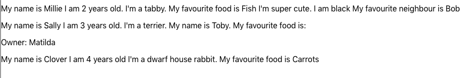
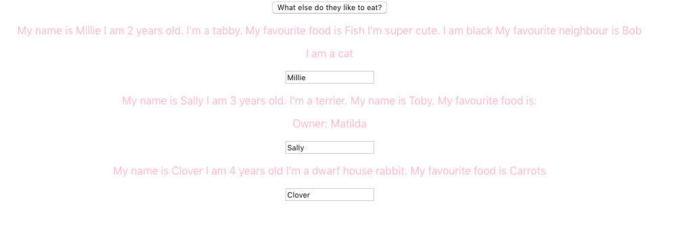
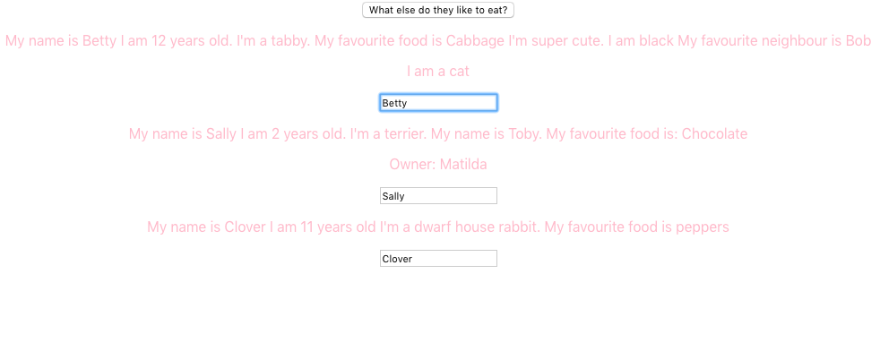
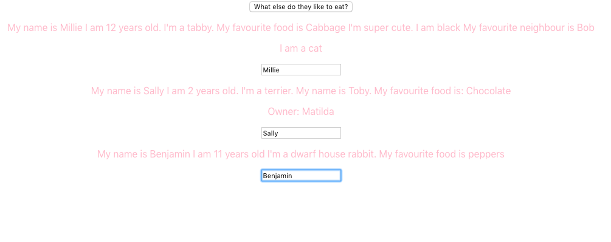

# React

# Notes 

* In App.js:

```html
import React, { Component } from 'react';
import './App.css';


class App extends Component {
    render() {
      return (
        <div className="App">
          <h1>I am a H1</h1>
          <h3>I am a H3</h3>
          <h5>I am a H5</h5>
          <p>I am a p</p>
          <p>I am also a p</p>
          <h4>I am a H4</h4>
          <ul>
            <li>1.</li>
            <li>2.</li>
          </ul>
        </div>
      ) 
    }
}

export default App;
```

* The above outputs the following in the browser:


* Creating components
* Components can be class-based or functional

* The following is a class-based component:

```html


import React, {Component} from 'react';

class Photo extends Component {
    render() {
      const post = this.props.post
      return <figure className="captionAndPic">
        
        <figcaption> <p> {post.description} </p> </figcaption>
        <div className="container-button">
          <button className="delete-button">Delete</button>
        </div>
      </figure>
    }
}

 
export default 
```

The same written as a functional component:

```html

import React from 'react';

function Photo(props)
  const post = props.post
      return <figure className="captionAndPic">
        
        <figcaption> <p> {post.description} </p> </figcaption>
        <div className="container-button">
          <button className="delete-button">Delete</button>
        </div>
      </figure>
    }

    export default Photo
```


* The following code shows App.js. Three components - Cat, Dog and Rabbit
have been created and then rendered.

```html
import React, { Component } from 'react';

import Cat from './Cat/Cat'
import Dog from './Dog/Dog'
import Rabbit from './Rabbit/Rabbit'


class App extends Component {
    render() {
      return (
        <div className="App">
          <h1>I am a H1</h1>
          <h3>I am a H3</h3>
          <h5>I am a H5</h5>
          <p>I am a p</p>
          <p>I am also a p</p>
          <h4>I am a H4</h4>
          <ul>
            <li>1.</li>
            <li>2.</li>
          </ul>
          <Cat />
          <Dog />
          <Rabbit />
        </div>
      ) 
    }
}

export default App;

``` 

The above looks like this in the browser:


* **Props**

* **Props** allow the passing of data from a parent component to a child component
* This could be described as passing data down the component tree, and it triggers
a re-render
* Props provide access to the attributes we give to our components
* We can pass properties/attributes to our components in App.js
* Pass props into the individual components as an argument
* Reference these attributes by using JavaScript expressions, using {}

App.js

```html

import React, { Component } from 'react';

import Cat from './Cat/Cat'
import Dog from './Dog/Dog'
import Rabbit from './Rabbit/Rabbit'


class App extends Component {
    render() {
      return (
        <div className="App">
          <h1>I am a H1</h1>
          <h3>I am a H3</h3>
          <Cat favouriteFood = "fish" color="black" favouriteNeighbour = "Bob" />
          <Dog favouriteHuman = "Tim" />
          <Rabbit />
        </div>
      ) 
    }
}

export default App;

``` 

Cat.js

```html
import React from 'react';

const cat = (props) => {
    return <p>I'm a tabby. My favourite food is {props.favouriteFood} I'm super cute. I am {props.color} My favourite neightbour is {props.favouriteNeighbour}</p>
};
  
export default cat;
```
The above renders as folows:


* **children**

* Children refers to elements that are passed between the opening and closing tags of the 
component - the embedded/nested components

App.js

```html
import React, { Component } from 'react';

import Cat from './Cat/Cat'
import Dog from './Dog/Dog'
import Rabbit from './Rabbit/Rabbit'


class App extends Component {
    render() {
      return (
        <div className="App">
          <h1>I am a H1</h1>
          <h3>I am a H3</h3>
          <Cat favouriteFood = "fish" color="black" favouriteNeighbour = "Bob" />
          <Dog favouriteHuman = "Tim">Owner: Matilda</Dog>
          <Rabbit />
        </div>
      ) 
    }
}

export default App;
```

Dog.js
```html
import React from 'react';

const dog = (props) => {
    return ( 
        <div>
    <p>I'm a terrier. My name is Toby I'm also super cute</p>
    <p>{props.children}</p>
    <h1>{props.children}</h1>
    <h6>{props.children}</h6>
    </div>
    )
};
  
export default dog;
```
The above renders as follows:


* **State**

* **State** the state of a component is an object that holds some information that may change over the lifetime of the component
* It is used to change the component from within 
* It is a property of the Component class
* It can be accessed via this.state which is returned in the
render() lifecycle method 
* Changes to the state result in an update of the UI - when the state
changes, the component re-renders to reflect the new state in the browser

App.js
```html

import React, { Component } from 'react';

import Cat from './Cat/Cat'
import Dog from './Dog/Dog'
import Rabbit from './Rabbit/Rabbit'

class App extends Component {
  state = {
    animals: [
      {name: 'Millie', age: 2},
      {name: 'Sally', age: 3},
      {name: 'Clover', age: 4}
    ]
  }
    render() {
      return (
        <div className="App">
          <h1>I am a H1</h1>
          <h3>I am a H3</h3>
          <Cat name ={this.state.animals[0].name} age ={this.state.animals[0].age} favouriteFood = "fish" color="black" favouriteNeighbour = "Bob" />
          <Dog name = {this.state.animals[1].name} age={this.state.animals[1].age} favouriteHuman = "Tim">Owner: Matilda</Dog>
          <Rabbit name={this.state.animals[2].name} age={this.state.animals[2].age} />
        </div>
      ) 
    }
}

export default App;
```
Cat.js

```html
import React from 'react';

const cat = (props) => {
    return <p>My name is {props.name} I am {props.age} years old. I'm a tabby. My favourite food is {props.favouriteFood} I'm super cute. I am {props.color} My favourite neighbour is {props.favouriteNeighbour}</p>
};
  

export default cat;
```

Dog.js
```html
const dog = (props) => {
    return ( 
        <div>
    <p>My name is {props.name} I am {props.age} years old. I'm a terrier. My name is Toby I'm also super cute</p>
    <p>{props.children}</p>
    </div>
    )
};
  
export default dog;
```
Rabbit.js
```html
import React from 'react';


const rabbit = (props) => {
    return <p>My name is {props.name} I am {props.age} years old I'm a dwarf house rabbit. I love carrots</p>
};
  

export default rabbit;
```

The above outputs the following in the browser:


* **State Manipulation**


* Only two things cause the DOM to be updated:
1. props
2. change of state 

App.js

```html
import React, { Component } from 'react';

import Cat from './Cat/Cat'
import Dog from './Dog/Dog'
import Rabbit from './Rabbit/Rabbit'


class App extends Component {
  state = {
    animals: [
      {name: 'Millie', age: 2, favouriteFood: 'Fish'},
      {name: 'Sally', age: 3, favouritefood: 'Peanut Butter'},
      {name: 'Clover', age: 4, favouriteFood: 'Carrots'}
    ]
  }

  changeFavouriteFood = () => {
  
    this.setState( {
      animals: [
        {name: 'Millie', age: 12, favouriteFood: 'Cabbage'},
        {name: 'Sally', age: 2, favouriteFood: 'Chocolate'},
        {name: 'Clover', age: 11, favouriteFood: 'peppers'}
      ]
    })
  }


    render() {
      return (
        <div className="App">
          <h1>I am a H1</h1>
          <h3>I am a H3</h3>
          <button onClick={this.changeFavouriteFood}>What else do they like to eat?</button>
          <Cat name ={this.state.animals[0].name} age ={this.state.animals[0].age} favouriteFood ={this.state.animals[0].favouriteFood} color="black" favouriteNeighbour = "Bob" />
          <Dog name = {this.state.animals[1].name} age={this.state.animals[1].age} favouriteFood={this.state.animals[1].favouriteFood} favouriteHuman = "Tim">Owner: Matilda</Dog>
          <Rabbit name={this.state.animals[2].name} age={this.state.animals[2].age} favouriteFood={this.state.animals[2].favouriteFood} />
        </div>
      ) 
    }
}

export default App;
```

Cat.js
```html
import React from 'react';

const cat = (props) => {
    return <p>My name is {props.name} I am {props.age} years old. I'm a tabby. My favourite food is {props.favouriteFood} I'm super cute. I am {props.color} My favourite neighbour is {props.favouriteNeighbour}</p>
};
  

export default cat;
```

Dog.js
```html
import React from 'react';

const dog = (props) => {
    return ( 
        <div>
    <p>My name is {props.name} I am {props.age} years old. I'm a terrier. My name is Toby. My favourite food is: {props.favouriteFood}</p>
    <p>{props.children}</p>
    </div>
    )
};
  
export default dog;
```

Rabbit.js
```html
import React from 'react';


const rabbit = (props) => {
    return <p>My name is {props.name} I am {props.age} years old I'm a dwarf house rabbit. My favourite food is {props.favouriteFood} </p>
};
  

export default rabbit;
```
The above renders as follows:

1. Before clicking the button:


2. After clicking the button:


* React merges the old state with the new state
The DOM gets updated because React recognises that the state of the application has changed


### State manipulation with functional components

#### React Hooks
React Hooks are functions that let you “hook into” React state and lifecycle features from function components. 
* React Hooks typically start with **use** and the most commonly used hook is **useState**
* Add it to the top of the App.js file like so: 

```html
import React, { useState } from 'react';
```

* The **useState** hook is the hook that enables state management in functional components
* The initial state is passed to useState()
* useState() returns an array with two elements:
a) the current state value
b) the function that updates that current state value 

* **Array destructuring** facilitates the extraction of elements from the array you get back

* With class-based components, the old state is merged with the new.
* this.setState automatically merges the old state with the new
However, with functional components, this doesn't happen. 
We have to manually copy the old state by using useState as many times as is needed

Example of converting a class-based component into a functional component:

The class-based component:

App.js

```html
import React, { Component } from 'react';

import Cat from './Cat/Cat'
import Dog from './Dog/Dog'
import Rabbit from './Rabbit/Rabbit'


class App extends Component {
  state = {
    animals: [
      {name: 'Millie', age: 2, favouriteFood: 'Fish'},
      {name: 'Sally', age: 3, favouritefood: 'Peanut Butter'},
      {name: 'Clover', age: 4, favouriteFood: 'Carrots'}
    ]
  }

  changeFavouriteFood = () => {
  
    this.setState( {
      animals: [
        {name: 'Millie', age: 12, favouriteFood: 'Cabbage'},
        {name: 'Sally', age: 2, favouriteFood: 'Chocolate'},
        {name: 'Clover', age: 11, favouriteFood: 'peppers'}
      ]
    })
  }

    render() {
      return (
        <div className="App">
          <button onClick={this.changeFavouriteFood}>What else do they like to eat?</button>
          <Cat name ={this.state.animals[0].name} 
            age ={this.state.animals[0].age} 
            favouriteFood ={this.state.animals[0].favouriteFood} 
            color="black" favouriteNeighbour = "Bob" />
          <Dog name = {this.state.animals[1].name} 
          age={this.state.animals[1].age} 
          favouriteFood={this.state.animals[1].favouriteFood} favouriteHuman = "Tim">Owner: Matilda</Dog>
          <Rabbit name={this.state.animals[2].name} 
          age={this.state.animals[2].age} 
          favouriteFood={this.state.animals[2].favouriteFood} />
        </div>
      ) 
    }
}

export default App;
```

Cat.js
```html
import React from 'react';

const cat = (props) => {
    return <p>My name is {props.name} I am {props.age} years old. I'm a tabby. My favourite food is {props.favouriteFood} I'm super cute. I am {props.color} My favourite neighbour is {props.favouriteNeighbour}</p>
};
  

export default cat;
```

Dog.js
```html
import React from 'react';

const dog = (props) => {
    return ( 
        <div>
    <p>My name is {props.name} I am {props.age} years old. I'm a terrier. My name is Toby. My favourite food is: {props.favouriteFood}</p>
    <p>{props.children}</p>
    </div>
    )
};
  
export default dog;
```

Rabbit.js
```html
import React from 'react';


const rabbit = (props) => {
    return <p>My name is {props.name} I am {props.age} years old I'm a dwarf house rabbit. My favourite food is {props.favouriteFood} </p>
};
  

export default rabbit;
```

**The new functional component that has been translated from the class-based component:**

```html
import React, { useState } from 'react';
import './App.css';
import Cat from './Cat/Cat'
import Dog from './Dog/Dog'
import Rabbit from './Rabbit/Rabbit'


const App = props => {
  const [ animalsState, setStateOfAnimals ] = useState({
    animals: [
      {name: 'Millie', age: 2, favouriteFood: 'Fish'},
      {name: 'Sally', age: 3, favouritefood: 'Peanut Butter'},
      {name: 'Clover', age: 4, favouriteFood: 'Carrots'}
    ]
  });

  console.log(animalsState)

  const changeFavouriteFood = () => {
    setStateOfAnimals( {
      animals: [
        {name: 'Millie', age: 12, favouriteFood: 'Cabbage'},
        {name: 'Sally', age: 2, favouriteFood: 'Chocolate'},
        {name: 'Clover', age: 11, favouriteFood: 'peppers'}
      ]
    })
  }
  
      return (
        <div className="App">
          <button onClick={changeFavouriteFood}>What else do they like to eat?</button>
          <Cat name ={animalsState.animals[0].name} 
          age ={animalsState.animals[0].age} 
          favouriteFood ={animalsState.animals[0].favouriteFood} 
          color="black" favouriteNeighbour = "Bob" />
          <Dog name = {animalsState.animals[1].name} 
          age={animalsState.animals[1].age} 
          favouriteFood={animalsState.animals[1].favouriteFood} 
           favouriteHuman = "Tim">Owner: Matilda</Dog>
          <Rabbit name={animalsState.animals[2].name} age={animalsState.animals[2].age} favouriteFood={animalsState.animals[2].favouriteFood} />
        </div>
      ) 
      }

export default App;
```
# Stateful vs. stateless components

* **Stateful components** - manage state, whether that be through React Hooks (functional components), or by using the state property and setState() (class-based components)
* Also known as 'smart' or 'container' components

* **Stateless components** - don't manage state.
* Also know as 'dumb' or 'presentational components'

An example of a stateless component:

```html

import React from 'react';

const cat = (props) => {
    return <p>My name is {props.name} I am {props.age} years old. I'm a tabby. My favourite food is {props.favouriteFood} I'm super cute. I am {props.color} My favourite neighbour is {props.favouriteNeighbour}</p>
};
  

export default cat;
```
* The focus should be on making stateless components, for the most part, and only creating
one or two stateful components, depending on the size of the application. 

### Props

**Props** are inputs to components.
* They are single values or objects containing a set of values that are passed to components upon creating.
* They can be descibed as data passed down from a parent component to a child component 

**Uses of Props**

* Pass custom data to components
* Trigger state changes

**Props vs. State**

* State and props are simply JS objects.
* Props get passed to the component
* State is managed within the component 

### Passing props and references to event handlers

**Passing method references between components**

* References to event handlers can be passed e.g. by adding a reference to the event handler - 
changeAnimalsProperties, in each instance of each component as shown below, and then adding
onClick={props.click} to each individual component, each component achieves the same goal as the button - that is to stay that is changes the state - all of the animals' properties are updating whether you click on the button, or on each of Cat, Dog or Rabbit
App.js

```html
render() {
      return (
        <div className="App">
          <button onClick={this.changeAnimalsProperties}>What else do they like to eat?</button>
          <Cat name ={this.state.animals[0].name} 
          age ={this.state.animals[0].age} 
          favouriteFood ={this.state.animals[0].favouriteFood} 
          color="black" 
          click={this.changeAnimalsProperties}
          favouriteNeighbour = "Bob" />
          <Dog name = {this.state.animals[1].name}
           age={this.state.animals[1].age} 
           favouriteFood={this.state.animals[1].favouriteFood}
           click={this.changeAnimalsProperties}
           favouriteHuman = "Tim">Owner: Matilda</Dog>
          <Rabbit name={this.state.animals[2].name} 
          age={this.state.animals[2].age} 
          click={this.changeAnimalsProperties}
          favouriteFood={this.state.animals[2].favouriteFood} />
        </div>
        ```

        Cat.js

        ```html
        import React from 'react';

const cat = (props) => {
    return (
    <div>
        <p onClick={props.click}>My name is {props.name} I am {props.age} years old. I'm a tabby. My favourite food is {props.favouriteFood} I'm super cute. I am {props.color} My favourite neighbour is {props.favouriteNeighbour}</p>
        <p>I am a cat</p>
     </div>
    )
};
  

export default cat;
```
Dog.js and Rabbit.js look that same 

**Passing arguments**

* Arguments can be passed using bind() e.g.

Code omitted for the sake of brevity 

```html
class App extends Component {
 state = { 
    animals: [
      {name: 'Milly', age: 2, favouriteFood: 'Fish'},
      {name: 'Sally', age: 3, favouritefood: 'Peanut Butter'},
      {name: 'Clover', age: 4, favouriteFood: 'Carrots'}
    ]
  }

  changeAnimalsProperties = (newName) => {
  
    this.setState( {
      animals: [
        {name: newName, age: 12, favouriteFood: 'Cabbage'},
        {name: 'Sally', age: 2, favouriteFood: 'Chocolate'},
        {name: 'Clover', age: 11, favouriteFood: 'peppers'}
      ]
    })
  }

    render() {
      return (
        <div className="App">
          <button onClick={this.changeAnimalsProperties.bind(this, "Lulu")}>What else do they like to eat?</button>
          <Cat name ={this.state.animals[0].name} 
          age ={this.state.animals[0].age} 

  ```
* newName is passed in as an arg to changeAnimalsProperties
* This data is passed using bind()
```html
<button onClick{this.changeAnimalsProperties.bind(this, "Lulu")}>

In the Cat component (Cat.js) 
```html
import React from 'react';

const cat = (props) => {
    return (
    <div>
        <p onClick={props.click}>My name is {props.name} I am {props.age} years old. I'm a tabby. My favourite food is {props.favouriteFood} I'm super cute. I am {props.color} My favourite neighbour is {props.favouriteNeighbour}</p>
        <p>I am a cat</p>
     </div>
    )
};

export default cat;
```

* When the button is cliked - the cat's name changes from Milly to Lulu - the new value
(newName)

* **Two-way binding and dynamic updates**

We can dynamically change the names of the different animals in the browser by entering a new new into the relevant text box

The following shows how we can change the name of the cat, in the browser


The following shows how we can change the name of the dog, in the browser

The following shows how we can change the name of the rabbit, in the browser


**How was this achieved?**

* The event listener - onChange was used. (onChange is fired whenever the input value changes)
* Three new methods were created: 
```html
changeNameDynamicallyCat()
changeNameDynamicallyDog()
changeNameDynamicallyRabbit()
```

all three of which update the state.

* These methods were passed an event object, each of which have a target - the input boxes in the respective components.
* Each target also has a value - which is the value entered into the text box(target)
* We bind onChange to the changed props in each component - each of which hold a reference to their respective event handler
* The default event object extracts the target 
* We utilize two-way binding by adding value={props.name}
to each component, so that the initial value is shown in the input box, before we start to change its value
* All in all, the state is updated, the props are updated and hence the changes in the input are reflected in the browser.


* The code for App.js, Cat.js, Dog.js and Rabbit.js:

App.js
```html
import React, { Component } from 'react';
import './App.css';
import Cat from './Cat/Cat'
import Dog from './Dog/Dog'
import Rabbit from './Rabbit/Rabbit'


class App extends Component {
 state = { 
    animals: [
      {name: 'Millie', age: 2, favouriteFood: 'Fish'},
      {name: 'Sally', age: 3, favouritefood: 'Peanut Butter'},
      {name: 'Clover', age: 4, favouriteFood: 'Carrots'}
    ]
  }

  changeAnimalsProperties = (newName) => {
  
    this.setState( {
      animals: [
        {name: newName, age: 12, favouriteFood: 'Cabbage'},
        {name: 'Sally', age: 2, favouriteFood: 'Chocolate'},
        {name: 'Clover', age: 11, favouriteFood: 'peppers'}
      ]
    })
  }

  changeNameDynamicallyCat = (event) => {
    this.setState( {
      animals: [
        { name: event.target.value, age: 12, favouriteFood: 'Cabbage'},
        { name: 'Sally', age: 2, favouriteFood: 'Chocolate'},
        { name: 'Clover', age: 11, favouriteFood: 'peppers'}
      ]
    })
  }

  changeNameDynamicallyRabbit= (event) => {
    this.setState( {
      animals: [
        { name: "Millie", age: 12, favouriteFood: 'Cabbage'},
        { name: 'Sally', age: 2, favouriteFood: 'Chocolate'},
        { name: event.target.value, age: 11, favouriteFood: 'peppers'}
      ]
    })
  }

  changeNameDynamicallyDog= (event) => {
    this.setState( {
      animals: [
        { name: "Millie", age: 12, favouriteFood: 'Cabbage'},
        { name: event.target.value, age: 2, favouriteFood: 'Chocolate'},
        { name: 'Clover', age: 11, favouriteFood: 'peppers'}
      ]
    })
  }

    render() {
      return (
        <div className="App">
          <button onClick={this.changeAnimalsProperties}>What else do they like to eat?</button>
          <Cat name ={this.state.animals[0].name} 
          age ={this.state.animals[0].age} 
          favouriteFood ={this.state.animals[0].favouriteFood} 
          color="black" 
          click={this.changeAnimalsProperties}
          changed={this.changeNameDynamicallyCat}
          favouriteNeighbour = "Bob" />
          <Dog name = {this.state.animals[1].name}
           age={this.state.animals[1].age} 
           favouriteFood={this.state.animals[1].favouriteFood}
           click={this.changeAnimalsProperties}
           changed={this.changeNameDynamicallyDog}
           favouriteHuman = "Tim">Owner: Matilda</Dog>
          <Rabbit name={this.state.animals[2].name} 
          age={this.state.animals[2].age} 
          click={this.changeAnimalsProperties}
          favouriteFood={this.state.animals[2].favouriteFood}
          changed={this.changeNameDynamicallyRabbit} />
        </div>
      ) 
    }
}

export default App;
```

Cat.js
```html
import React from 'react';

const cat = (props) => {
    return (
    <div>
        <p onClick={props.click}>My name is {props.name} I am {props.age} years old. I'm a tabby. My favourite food is {props.favouriteFood} I'm super cute. I am {props.color} My favourite neighbour is {props.favouriteNeighbour}</p>
        <p>I am a cat</p>
        <input type="text" onChange={props.changed} value = {props.name}/>
     </div>
    )
};
  

export default cat;
```
Dog.js
```html
const dog = (props) => {
    return ( 
        <div>
    <p onClick={props.click}>My name is {props.name} I am {props.age} years old. I'm a terrier. My name is Toby. My favourite food is: {props.favouriteFood}</p>
    <p>{props.children}</p>
    <input type="text" onChange={props.changed} value={props.name}/>
    </div>
    )
};
  
export default dog;
```

Rabbit.js
```html
import React from 'react';


const rabbit = (props) => {
    return (
    <div>
    <p onClick={props.click}>My name is {props.name} I am {props.age} years old I'm a dwarf house rabbit. My favourite food is {props.favouriteFood} </p>
<input type="text" onChange={props.changed} value={props.name}/>
</div>
    )
};
  
export default rabbit;
```

### Styling React

* There are different ways to style React components
* 1 - Use stylesheets
* 2 - Use inline styling

* **Stylesheets**

* The important thing to remember is to import the .css file into the component file e.g.
I created a Dog.css file, so in my Dog.js file, I had to add the following:

```html
import './Dog.css';
```

I did the same for the Rabbit and Cat components.

The following shows three differently styled components, although the styling is not something I'd want to use in 'real' code:


**Inline Styling**


**Lifecycle Methods**

* **Lifecycle methods** - let you define pieces of code you want to execute according to the state of the component like mounting, rendering, updating and un-mounting.


