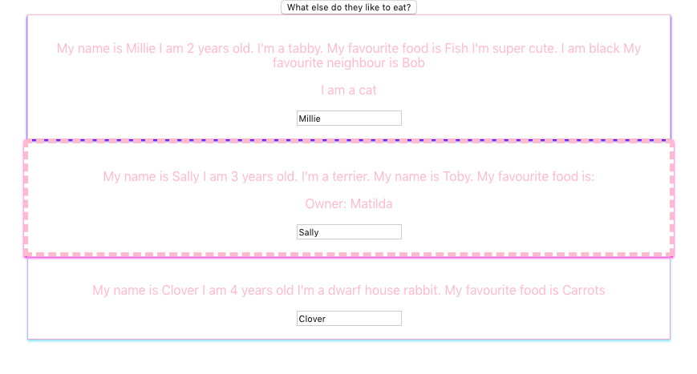
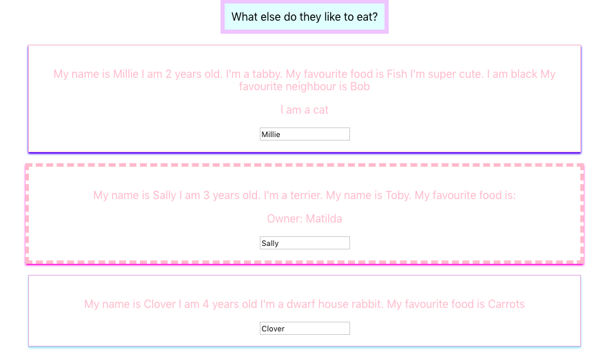

# Notes 

* A core philosophy of React is to split applications into small pieces - separate, lean, reusable components
* Ideally, tasks should be delegated to other components
* There are two types of components - stateful(clever) components and presentational(dumb) components
* The former typically manages state
* The latter tend to have responsibility for styling etc
* It is common to have far more presentational components in a React application than stateful components  

* Rendering content dynamically 

```html
import React from 'react';
import ReactDOM from 'react-dom'


 const App = () => {
   const now = new Date()
   const a = 10
   const b = 20

   console.log('Hello from component')
   return (
   <div>
     <p>Hello world</p>
     <p>
       {a} plus {b} is { a + b }
     </p>
   </div>
   )
 }

export default App;
```
**JSX**

* The layout of React components is mostly written using JSX
* The JSX returned by React components is compiled into JavaScript, by Babel
* Projects created using create-react-app are configured to compile automatically 
* It is also possible to write React as "pure JavaScript" without using JSX, but this would take much longer
* JSX is similar to HTML. However, with JSX, dynamic content can be embedded by writing appropriate JS within curly braces
* JSX is 'XML-like' in that every tag must be closed />
* The only place where JavaScript can be written directly (without being embedded in curly braces), is between the render() method and the return statement. You can write pure JS there and save it to a variable. Then refer to this variable at a later point


After compiling, the application looks like this:

```html
import React from 'react'
import ReactDOM from 'react-dom'

const App = () => {
  const now = new Date()
  const a = 10
  const b = 20
  return React.createElement(
    'div',
    null,
    React.createElement(
      'p', null, 'Hello world, it is ', now.toString()
    ),
    React.createElement(
      'p', null, a, ' plus ', b, ' is ', a + b
    )
  )
}

ReactDOM.render(
  React.createElement(App, null),
  document.getElementById('root')
)
```

**Components**

* Components should be capitalized 
* Components should 'end' with 
```html
export default nameOfComponent
```

* Writing components with React is easy, and by combining components, even a more complex application can be kept fairly maintainable. 
Indeed, a core philosophy of React is composing applications from many specialized reusable components.
* Oftentimes, the App component is the 'root' component. Sometimes, however, this is not the case

**props**

* Data can be passed to components using props
* In class-based components, data is referred to using this.props.name. Anytime you refer to a class component within itself, 'this' must be used.
* To access props within a class component, 'this' needs to preface the code you use to access it 
* In functional components, data is referred to using props.name - no use of the 'this' keyword

App.js

```html
import React from 'react';
import ReactDOM from 'react-dom';
import Hello from './Hello';


 const App = () => {

   return (
   <div>
     <p>Hello world</p>
     <Hello name="Emily" />
     <Hello name="Lucy" />
   </div>
   )
 }

export default App;
```

Hello.js

```html
import React from 'react';
import ReactDOM from 'react-dom'


const Hello = (props) => {
    return (
      <div>
        <p>Hello {props.name}</p>
      </div>
    )
    }

export default Hello
```

* In App.js:

```html
import React, { Component } from 'react';
import './App.css';


class App extends Component {
    render() {
      return (
        <div className="App">
          <h1>I am a H1</h1>
          <h3>I am a H3</h3>
          <h5>I am a H5</h5>
          <p>I am a p</p>
          <p>I am also a p</p>
          <h4>I am a H4</h4>
          <ul>
            <li>1.</li>
            <li>2.</li>
          </ul>
        </div>
      ) 
    }
}

export default App;
```

* The above outputs the following in the browser:


### Props continued 


* Props are single values or objects containing a set of values that are passed to components upon creation.


**Uses of Props**

* Pass custom data to components
* Trigger state changes

**Props vs. State**

* State and props are simply JS objects.
* Props get passed to the component
* State is managed within the component 

### Passing props and references to event handlers

**Passing method references between components**

* References to event handlers can be passed e.g. by adding a reference to the event handler - 
changeAnimalsProperties, in each instance of each component as shown below, and then adding
onClick={props.click} to each individual component, each component achieves the same goal as the button - that is to stay that is changes the state - all of the animals' properties are updating whether you click on the button, or on each of Cat, Dog or Rabbit
App.js

```html
render() {
      return (
        <div className="App">
          <button onClick={this.changeAnimalsProperties}>What else do they like to eat?</button>
          <Cat name ={this.state.animals[0].name} 
          age ={this.state.animals[0].age} 
          favouriteFood ={this.state.animals[0].favouriteFood} 
          color="black" 
          click={this.changeAnimalsProperties}
          favouriteNeighbour = "Bob" />
          <Dog name = {this.state.animals[1].name}
           age={this.state.animals[1].age} 
           favouriteFood={this.state.animals[1].favouriteFood}
           click={this.changeAnimalsProperties}
           favouriteHuman = "Tim">Owner: Matilda</Dog>
          <Rabbit name={this.state.animals[2].name} 
          age={this.state.animals[2].age} 
          click={this.changeAnimalsProperties}
          favouriteFood={this.state.animals[2].favouriteFood} />
        </div>
        ```

        Cat.js

        ```html
        import React from 'react';

const cat = (props) => {
    return (
    <div>
        <p onClick={props.click}>My name is {props.name} I am {props.age} years old. I'm a tabby. My favourite food is {props.favouriteFood} I'm super cute. I am {props.color} My favourite neighbour is {props.favouriteNeighbour}</p>
        <p>I am a cat</p>
     </div>
    )
};
  

export default cat;
```
Dog.js and Rabbit.js look the same 


* Creating components
* Components can be class-based or functional

* The following is a class-based component:

```html


import React, {Component} from 'react';

class Photo extends Component {
    render() {
      const post = this.props.post
      return <figure className="captionAndPic">
        
        <figcaption> <p> {post.description} </p> </figcaption>
        <div className="container-button">
          <button className="delete-button">Delete</button>
        </div>
      </figure>
    }
}

 
export default 
```

The same written as a functional component:

```html

import React from 'react';

function Photo(props)
  const post = props.post
      return <figure className="captionAndPic">
        
        <figcaption> <p> {post.description} </p> </figcaption>
        <div className="container-button">
          <button className="delete-button">Delete</button>
        </div>
      </figure>
    }

    export default Photo
```


* The following code shows App.js. Three components - Cat, Dog and Rabbit
have been created and then rendered.

```html
import React, { Component } from 'react';

import Cat from './Cat/Cat'
import Dog from './Dog/Dog'
import Rabbit from './Rabbit/Rabbit'


class App extends Component {
    render() {
      return (
        <div className="App">
          <h1>I am a H1</h1>
          <h3>I am a H3</h3>
          <h5>I am a H5</h5>
          <p>I am a p</p>
          <p>I am also a p</p>
          <h4>I am a H4</h4>
          <ul>
            <li>1.</li>
            <li>2.</li>
          </ul>
          <Cat />
          <Dog />
          <Rabbit />
        </div>
      ) 
    }
}

export default App;

``` 

The above looks like this in the browser:


* **Props**

* **Props** allow the passing of data from a parent component to a child component
* This could be described as passing data down the component tree and triggering 
a re-render
* Props provide access to the attributes we give to our components
* Prop should be passed into individual components as an argument


App.js

```html

import React, { Component } from 'react';

import Cat from './Cat/Cat'
import Dog from './Dog/Dog'
import Rabbit from './Rabbit/Rabbit'


class App extends Component {
    render() {
      return (
        <div className="App">
          <h1>I am a H1</h1>
          <h3>I am a H3</h3>
          <Cat favouriteFood = "fish" color="black" favouriteNeighbour = "Bob" />
          <Dog favouriteHuman = "Tim" />
          <Rabbit />
        </div>
      ) 
    }
}

export default App;

``` 

Cat.js

```html
import React from 'react';

const cat = (props) => {
    return <p>I'm a tabby. My favourite food is {props.favouriteFood} I'm super cute. I am {props.color} My favourite neightbour is {props.favouriteNeighbour}</p>
};
  
export default cat;
```
The above renders as folows:


* **children**

* Children refers to elements that are passed between the opening and closing tags of the 
component. The embedded/nested components

App.js

```html
import React, { Component } from 'react';

import Cat from './Cat/Cat'
import Dog from './Dog/Dog'
import Rabbit from './Rabbit/Rabbit'


class App extends Component {
    render() {
      return (
        <div className="App">
          <h1>I am a H1</h1>
          <h3>I am a H3</h3>
          <Cat favouriteFood = "fish" color="black" favouriteNeighbour = "Bob" />
          <Dog favouriteHuman = "Tim">Owner: Matilda</Dog>
          <Rabbit />
        </div>
      ) 
    }
}

export default App;
```

Dog.js
```html
import React from 'react';

const dog = (props) => {
    return ( 
        <div>
    <p>I'm a terrier. My name is Toby I'm also super cute</p>
    <p>{props.children}</p>
    <h1>{props.children}</h1>
    <h6>{props.children}</h6>
    </div>
    )
};
  
export default dog;
```
The above renders as follows:


* **State**

* **State** the state of a component is an object that holds some information that may change over the lifetime of the component
* It is used to change the component from within 
* State is a property of the Component class
* It can be accessed via this.state in classical components, which is returned in the
lifecycle method - render() 
* Changes to the state result in an update of the UI - when the state
changes, the component re-renders to reflect the new state in the browser

* With functional components, we can use the hook useState() to manage state
* Calling the useState hook returns an array with two values - 
1 - the state itself/the latest state snapshot
2 - the function to change the state - this function allows deve to update the state and tells React that it should re-render. Best to start this method with 'set'
* NB - Any functions that start with 'use' in React are hook functions
* useState only initialises that state when the component is rendered for the first time
* And for subsequent re-render cycles - it just pulls out the latest state snapshot and and ignores the initial value we set

Example of the useState hook in action:
```html
function Radio() {
const [isPlaying, setIsPlaying] = useState(true);
<div className=“radio”>
  The radio is {isPlaying? “Playing” : “not playing”}
<br />
<button onClick={() => setIsPlaying(!isPlaying)}>
  On/Off
</button>
</div>
```

When the button is clicked, the setIsPlaying method is called and changes the state to be the opposite of what it currently is (toggles it)
e.g.
If the radio isn’t playing - it changes it to is playing, and vice versa

The button onClick={() =>  must be wrapped with an arrow function as it delays execution of the method until the button is clicked - the function is only executed when the button is clicked
If we don’t wrap it in an arrow function - the setIsPlaying function will be invoked before the button is even rendered

The setIsPlaying() method does two things: 
1 - changes the state
2 - then it re-renders the component

If you just change the variable directly, React has no way of knowing that it changed, and it won’t re-render
isPlaying is a regular old variable that will go out of scope at the end of the function and any changes to it would be lost
So that’s why it’s important to call the setter, so that React can update the value of that hook’s state behind the scenes


### useEffect hook
```html

React.useEffect(() => {
  axios.get(`https://www.fakeapi.json`)
    .then(res => {
      const newListings = res.data.data.children
      .map(obj => obj.data);
setListings(newListings);
});
}, []);

```
* The useEffect hook gets passed a function.
* useEffect then 'queues up' that function to run after render is done.
* Here, the effect calls axios.get to fetch data from the fake API, which returns a promise,  and the .then handler will get called once the fetch is finished.
The fake Api returns the listings in a  deeply-nested structure, so the res.data.data.children.map... is picking out the individual posts from the nested structure.

Finally, it updates the listings state by calling setListing 


### useEffect Dependency Array


<hr>


App.js
```html

import React, { Component } from 'react';

import Cat from './Cat/Cat'
import Dog from './Dog/Dog'
import Rabbit from './Rabbit/Rabbit'

class App extends Component {
  state = {
    animals: [
      {name: 'Millie', age: 2},
      {name: 'Sally', age: 3},
      {name: 'Clover', age: 4}
    ]
  }
    render() {
      return (
        <div className="App">
          <h1>I am a H1</h1>
          <h3>I am a H3</h3>
          <Cat name ={this.state.animals[0].name} age ={this.state.animals[0].age} favouriteFood = "fish" color="black" favouriteNeighbour = "Bob" />
          <Dog name = {this.state.animals[1].name} age={this.state.animals[1].age} favouriteHuman = "Tim">Owner: Matilda</Dog>
          <Rabbit name={this.state.animals[2].name} age={this.state.animals[2].age} />
        </div>
      ) 
    }
}

export default App;
```
Cat.js

```html
import React from 'react';

const cat = (props) => {
    return <p>My name is {props.name} I am {props.age} years old. I'm a tabby. My favourite food is {props.favouriteFood} I'm super cute. I am {props.color} My favourite neighbour is {props.favouriteNeighbour}</p>
};
  

export default cat;
```

Dog.js
```html
const dog = (props) => {
    return ( 
        <div>
    <p>My name is {props.name} I am {props.age} years old. I'm a terrier. My name is Toby I'm also super cute</p>
    <p>{props.children}</p>
    </div>
    )
};
  
export default dog;
```
Rabbit.js
```html
import React from 'react';


const rabbit = (props) => {
    return <p>My name is {props.name} I am {props.age} years old I'm a dwarf house rabbit. I love carrots</p>
};
  

export default rabbit;
```

The above outputs the following in the browser:


### **More component state**

App.js

```html
import React from 'react';
import Hello from './Hello';

const App = () => {
  const name = 'Marvin'
  const age = 20

  return (
    <div>
      <h1>Greetings</h1>
      <Hello name="Jess" age={16 + 10} />
      <Hello name={name} age={age} />
    </div>
  )
}

export default App;
``` 

Hello.js
```html
import React from 'react';

const Hello = (props) => {
    const yearBorn = () => {
        const yearNow = new Date().getFullYear()
        return yearNow - props.age
    }
  return (
    <div>
      <p>
        Hello {props.name}, you are {props.age} years old
      </p>
      <p>You were born in {yearBorn()}</p>
      </div>
  )
}

export default Hello
```

This outputs the following in the browser:


* The logic for guessing the person's birth year is separated into its own function that is called when the component is rendered.

T* he person's age needn't be passed as a param to the function, since it can directly access all props that are passed to the component.

### **State Manipulation**


* Only two things cause the DOM to be updated:
1. props
2. change of state 

App.js

```html
import React, { Component } from 'react';

import Cat from './Cat/Cat'
import Dog from './Dog/Dog'
import Rabbit from './Rabbit/Rabbit'


class App extends Component {
  state = {
    animals: [
      {name: 'Millie', age: 2, favouriteFood: 'Fish'},
      {name: 'Sally', age: 3, favouritefood: 'Peanut Butter'},
      {name: 'Clover', age: 4, favouriteFood: 'Carrots'}
    ]
  }

  changeFavouriteFood = () => {
  
    this.setState( {
      animals: [
        {name: 'Millie', age: 12, favouriteFood: 'Cabbage'},
        {name: 'Sally', age: 2, favouriteFood: 'Chocolate'},
        {name: 'Clover', age: 11, favouriteFood: 'peppers'}
      ]
    })
  }


    render() {
      return (
        <div className="App">
          <h1>I am a H1</h1>
          <h3>I am a H3</h3>
          <button onClick={this.changeFavouriteFood}>What else do they like to eat?</button>
          <Cat name ={this.state.animals[0].name} age ={this.state.animals[0].age} favouriteFood ={this.state.animals[0].favouriteFood} color="black" favouriteNeighbour = "Bob" />
          <Dog name = {this.state.animals[1].name} age={this.state.animals[1].age} favouriteFood={this.state.animals[1].favouriteFood} favouriteHuman = "Tim">Owner: Matilda</Dog>
          <Rabbit name={this.state.animals[2].name} age={this.state.animals[2].age} favouriteFood={this.state.animals[2].favouriteFood} />
        </div>
      ) 
    }
}

export default App;
```

Cat.js
```html
import React from 'react';

const cat = (props) => {
    return <p>My name is {props.name} I am {props.age} years old. I'm a tabby. My favourite food is {props.favouriteFood} I'm super cute. I am {props.color} My favourite neighbour is {props.favouriteNeighbour}</p>
};
  

export default cat;
```

Dog.js
```html
import React from 'react';

const dog = (props) => {
    return ( 
        <div>
    <p>My name is {props.name} I am {props.age} years old. I'm a terrier. My name is Toby. My favourite food is: {props.favouriteFood}</p>
    <p>{props.children}</p>
    </div>
    )
};
  
export default dog;
```

Rabbit.js
```html
import React from 'react';


const rabbit = (props) => {
    return <p>My name is {props.name} I am {props.age} years old I'm a dwarf house rabbit. My favourite food is {props.favouriteFood} </p>
};
  

export default rabbit;
```
The above renders as follows:

1. Before clicking the button:


2. After clicking the button:


* React merges the old state with the new state
The DOM gets updated because React recognises that the state of the application has changed


### State manipulation with functional components

#### React Hooks
React Hooks are functions that let you “hook into” React state and lifecycle features from functional components. 
* React Hooks typically start with **use** and the most commonly used hook is **useState**
* Needs to be imported into the relevant files, like so: 

```html
import React, { useState } from 'react';
```

* The **useState** hook is the hook that enables state management in functional components
* The initial state is passed to useState()
* useState() returns an array with two elements:
a) the current state value
b) the function that updates that current state value 

### **Array destructuring** facilitates the extraction of elements from the array you get back

* With class-based components, the old state is merged with the new.
* this.setState automatically merges the old state with the new
However, with functional components, this doesn't happen. 
We have to manually copy the old state by using useState as many times as it needed

Example of converting a class-based component into a functional component:

The class-based component:

App.js

```html
import React, { Component } from 'react';

import Cat from './Cat/Cat'
import Dog from './Dog/Dog'
import Rabbit from './Rabbit/Rabbit'


class App extends Component {
  state = {
    animals: [
      {name: 'Millie', age: 2, favouriteFood: 'Fish'},
      {name: 'Sally', age: 3, favouritefood: 'Peanut Butter'},
      {name: 'Clover', age: 4, favouriteFood: 'Carrots'}
    ]
  }

  changeFavouriteFood = () => {
  
    this.setState( {
      animals: [
        {name: 'Millie', age: 12, favouriteFood: 'Cabbage'},
        {name: 'Sally', age: 2, favouriteFood: 'Chocolate'},
        {name: 'Clover', age: 11, favouriteFood: 'peppers'}
      ]
    })
  }

    render() {
      return (
        <div className="App">
          <button onClick={this.changeFavouriteFood}>What else do they like to eat?</button>
          <Cat name ={this.state.animals[0].name} 
            age ={this.state.animals[0].age} 
            favouriteFood ={this.state.animals[0].favouriteFood} 
            color="black" favouriteNeighbour = "Bob" />
          <Dog name = {this.state.animals[1].name} 
          age={this.state.animals[1].age} 
          favouriteFood={this.state.animals[1].favouriteFood} favouriteHuman = "Tim">Owner: Matilda</Dog>
          <Rabbit name={this.state.animals[2].name} 
          age={this.state.animals[2].age} 
          favouriteFood={this.state.animals[2].favouriteFood} />
        </div>
      ) 
    }
}

export default App;
```

Cat.js
```html
import React from 'react';

const cat = (props) => {
    return <p>My name is {props.name} I am {props.age} years old. I'm a tabby. My favourite food is {props.favouriteFood} I'm super cute. I am {props.color} My favourite neighbour is {props.favouriteNeighbour}</p>
};
  

export default cat;
```

Dog.js
```html
import React from 'react';

const dog = (props) => {
    return ( 
        <div>
    <p>My name is {props.name} I am {props.age} years old. I'm a terrier. My name is Toby. My favourite food is: {props.favouriteFood}</p>
    <p>{props.children}</p>
    </div>
    )
};
  
export default dog;
```

Rabbit.js
```html
import React from 'react';


const rabbit = (props) => {
    return <p>My name is {props.name} I am {props.age} years old I'm a dwarf house rabbit. My favourite food is {props.favouriteFood} </p>
};
  

export default rabbit;
```

**The new functional component that has been translated from the class-based component:**

```html
import React, { useState } from 'react';
import './App.css';
import Cat from './Cat/Cat'
import Dog from './Dog/Dog'
import Rabbit from './Rabbit/Rabbit'


const App = props => {
  const [ animalsState, setStateOfAnimals ] = useState({
    animals: [
      {name: 'Millie', age: 2, favouriteFood: 'Fish'},
      {name: 'Sally', age: 3, favouritefood: 'Peanut Butter'},
      {name: 'Clover', age: 4, favouriteFood: 'Carrots'}
    ]
  });

  console.log(animalsState)

  const changeFavouriteFood = () => {
    setStateOfAnimals( {
      animals: [
        {name: 'Millie', age: 12, favouriteFood: 'Cabbage'},
        {name: 'Sally', age: 2, favouriteFood: 'Chocolate'},
        {name: 'Clover', age: 11, favouriteFood: 'peppers'}
      ]
    })
  }
  
      return (
        <div className="App">
          <button onClick={changeFavouriteFood}>What else do they like to eat?</button>
          <Cat name ={animalsState.animals[0].name} 
          age ={animalsState.animals[0].age} 
          favouriteFood ={animalsState.animals[0].favouriteFood} 
          color="black" favouriteNeighbour = "Bob" />
          <Dog name = {animalsState.animals[1].name} 
          age={animalsState.animals[1].age} 
          favouriteFood={animalsState.animals[1].favouriteFood} 
           favouriteHuman = "Tim">Owner: Matilda</Dog>
          <Rabbit name={animalsState.animals[2].name} age={animalsState.animals[2].age} favouriteFood={animalsState.animals[2].favouriteFood} />
        </div>
      ) 
      }

export default App;
```
### Stateful vs. stateless components

* **Stateful components** - manage state, whether that be through React Hooks (functional components), or by using the state property and setState() (class-based components)
* Also known as 'smart' or 'container' components

* **Stateless components** - don't manage state.
* Also know as 'dumb' or 'presentational components'

An example of a stateless component:

```html

import React from 'react';

const cat = (props) => {
    return <p>My name is {props.name} I am {props.age} years old. I'm a tabby. My favourite food is {props.favouriteFood} I'm super cute. I am {props.color} My favourite neighbour is {props.favouriteNeighbour}</p>
};
  

export default cat;
```
* The focus should be on making stateless components, for the most part, and only creating
one or two stateful components, depending on the size of the application. 


### **Passing arguments**

* Arguments can be passed using bind() e.g.

Code omitted for the sake of brevity 

```html
class App extends Component {
 state = { 
    animals: [
      {name: 'Milly', age: 2, favouriteFood: 'Fish'},
      {name: 'Sally', age: 3, favouritefood: 'Peanut Butter'},
      {name: 'Clover', age: 4, favouriteFood: 'Carrots'}
    ]
  }

  changeAnimalsProperties = (newName) => {
  
    this.setState( {
      animals: [
        {name: newName, age: 12, favouriteFood: 'Cabbage'},
        {name: 'Sally', age: 2, favouriteFood: 'Chocolate'},
        {name: 'Clover', age: 11, favouriteFood: 'peppers'}
      ]
    })
  }

    render() {
      return (
        <div className="App">
          <button onClick={this.changeAnimalsProperties.bind(this, "Lulu")}>What else do they like to eat?</button>
          <Cat name ={this.state.animals[0].name} 
          age ={this.state.animals[0].age} 

  ```
* newName is passed in as an arg to changeAnimalsProperties
* This data is passed using bind()
```html
<button onClick{this.changeAnimalsProperties.bind(this, "Lulu")}>

In the Cat component (Cat.js) 
```html
import React from 'react';

const cat = (props) => {
    return (
    <div>
        <p onClick={props.click}>My name is {props.name} I am {props.age} years old. I'm a tabby. My favourite food is {props.favouriteFood} I'm super cute. I am {props.color} My favourite neighbour is {props.favouriteNeighbour}</p>
        <p>I am a cat</p>
     </div>
    )
};

export default cat;
```

* When the button is clicked - the cat's name changes from Milly to Lulu - the new value
(newName)

* **Two-way binding and dynamic updates**

We can dynamically change the names of the different animals in the browser by entering a new new into the relevant text box

The following shows how we can change the name of the cat, in the browser


The following shows how we can change the name of the dog, in the browser

The following shows how we can change the name of the rabbit, in the browser


**How was this achieved?**

* The event handler - onChange was used. (onChange is fired whenever the input value changes)
* Three new methods were created: 
```html
changeNameDynamicallyCat()
changeNameDynamicallyDog()
changeNameDynamicallyRabbit()
```

all three of which update the state.

* These methods were passed an event object, each of which have a target - the input boxes in the respective components.
* Each target also has a value - which is the value entered into the text box(target)
* We bind onChange to the changed props in each component - each of which hold a reference to their respective event handler
* The default event object extracts the target 
* We utilize two-way binding by adding value={props.name}
to each component, so that the initial value is shown in the input box, before we start to change its value
* All in all, the state is updated, the props are updated and hence the changes in the input are reflected in the browser.


* The code for App.js, Cat.js, Dog.js and Rabbit.js:

App.js
```html
import React, { Component } from 'react';
import './App.css';
import Cat from './Cat/Cat'
import Dog from './Dog/Dog'
import Rabbit from './Rabbit/Rabbit'


class App extends Component {
 state = { 
    animals: [
      {name: 'Millie', age: 2, favouriteFood: 'Fish'},
      {name: 'Sally', age: 3, favouritefood: 'Peanut Butter'},
      {name: 'Clover', age: 4, favouriteFood: 'Carrots'}
    ]
  }

  changeAnimalsProperties = (newName) => {
  
    this.setState( {
      animals: [
        {name: newName, age: 12, favouriteFood: 'Cabbage'},
        {name: 'Sally', age: 2, favouriteFood: 'Chocolate'},
        {name: 'Clover', age: 11, favouriteFood: 'peppers'}
      ]
    })
  }

  changeNameDynamicallyCat = (event) => {
    this.setState( {
      animals: [
        { name: event.target.value, age: 12, favouriteFood: 'Cabbage'},
        { name: 'Sally', age: 2, favouriteFood: 'Chocolate'},
        { name: 'Clover', age: 11, favouriteFood: 'peppers'}
      ]
    })
  }

  changeNameDynamicallyRabbit= (event) => {
    this.setState( {
      animals: [
        { name: "Millie", age: 12, favouriteFood: 'Cabbage'},
        { name: 'Sally', age: 2, favouriteFood: 'Chocolate'},
        { name: event.target.value, age: 11, favouriteFood: 'peppers'}
      ]
    })
  }

  changeNameDynamicallyDog= (event) => {
    this.setState( {
      animals: [
        { name: "Millie", age: 12, favouriteFood: 'Cabbage'},
        { name: event.target.value, age: 2, favouriteFood: 'Chocolate'},
        { name: 'Clover', age: 11, favouriteFood: 'peppers'}
      ]
    })
  }

    render() {
      return (
        <div className="App">
          <button onClick={this.changeAnimalsProperties}>What else do they like to eat?</button>
          <Cat name ={this.state.animals[0].name} 
          age ={this.state.animals[0].age} 
          favouriteFood ={this.state.animals[0].favouriteFood} 
          color="black" 
          click={this.changeAnimalsProperties}
          changed={this.changeNameDynamicallyCat}
          favouriteNeighbour = "Bob" />
          <Dog name = {this.state.animals[1].name}
           age={this.state.animals[1].age} 
           favouriteFood={this.state.animals[1].favouriteFood}
           click={this.changeAnimalsProperties}
           changed={this.changeNameDynamicallyDog}
           favouriteHuman = "Tim">Owner: Matilda</Dog>
          <Rabbit name={this.state.animals[2].name} 
          age={this.state.animals[2].age} 
          click={this.changeAnimalsProperties}
          favouriteFood={this.state.animals[2].favouriteFood}
          changed={this.changeNameDynamicallyRabbit} />
        </div>
      ) 
    }
}

export default App;
```

Cat.js
```html
import React from 'react';

const cat = (props) => {
    return (
    <div>
        <p onClick={props.click}>My name is {props.name} I am {props.age} years old. I'm a tabby. My favourite food is {props.favouriteFood} I'm super cute. I am {props.color} My favourite neighbour is {props.favouriteNeighbour}</p>
        <p>I am a cat</p>
        <input type="text" onChange={props.changed} value = {props.name}/>
     </div>
    )
};
  

export default cat;
```
Dog.js
```html
const dog = (props) => {
    return ( 
        <div>
    <p onClick={props.click}>My name is {props.name} I am {props.age} years old. I'm a terrier. My name is Toby. My favourite food is: {props.favouriteFood}</p>
    <p>{props.children}</p>
    <input type="text" onChange={props.changed} value={props.name}/>
    </div>
    )
};
  
export default dog;
```

Rabbit.js
```html
import React from 'react';


const rabbit = (props) => {
    return (
    <div>
    <p onClick={props.click}>My name is {props.name} I am {props.age} years old I'm a dwarf house rabbit. My favourite food is {props.favouriteFood} </p>
<input type="text" onChange={props.changed} value={props.name}/>
</div>
    )
};
  
export default rabbit;
```

### Styling React Applications

* There are different ways to style React components
* 1 - Use stylesheets
* 2 - Use inline styling
* 3 - Use  variables 
* 4 - Use functions - for dynamic styling - i.e. the style changes when certain things happen e.g. a button is clicked 

### * **Stylesheets**

* The important thing to remember is to import the .css file into the component file e.g.
I created a Dog.css file, so in my Dog.js file, I had to add the following:

```html
import './Dog.css';
```

I did the same for the Rabbit and Cat components.

The following shows three differently styled components, although the styling is not something I'd want to use in 'real' code:



### **Inline Styling**

* Inline styling can also be used.
* To style an element with the inline style attribute, the value must be a JavaScript object
* Since the inline CSS is written in a JavaScript object, properties such as background-color, which normally utilize a -, must be written with camel case syntax e.g.
backgroundColor
* When using inline styling, we need to use double curly braces {{ }}

### **Styling with variables**

Other code ommitted for brevity:

```html
render() {

      const style = {
        backgroundColor: '#e6ffff',
        font: 'inherit',
        border: '6px solid #e6ccff',
        padding: '10px'
      }

      return (
        <div className="App">
          <button style={style} onClick={this.changeAnimalsProperties}>What else do they like to eat?</button>
          <Cat name ={this.state.animals[0].name} 
          age ={this.state.animals[0].age} 
  ```
  The above button looks like this:



A comparison of inline styling and use of variables to style components:

**Inline styling**
```html


<div style={{backgroundColor: ‘pink’ }}>
  <p>{this.props.todo.title}</p>
</div>
```

**Styling using variables**

```html

const styling = {
backgroundColor: ‘pink’
}

<div style={styling}>
  <p>{this.props.todo.title}</p>
</div>

```

### **Dynamic styling using functions**

* Possible use case - a todo list. If an item has been completed i.e the user has checked the checkbox, we might want to see a line through the completed item.
* This can be achieved using functions

```html

getStyle = () => {
  if(this.props.todo.completed){

    return { 
      textDecoration: ‘line-through’
  } else {
    return {
      textDecoration: ‘none’
  }  
}

render()
  return() {
    <div style={this.getStyle()}>
      <p>{ this.props.todo.title }</p>
    </div> 
}

```

With the above, if items have a completed status of true - a line will appear through them (once the user has checked the checkbox) - otherwise, the todo items don't have a line through them.

### Material UI

Another option is to use Material UI. Material UI is similar to BootStrap but it is a little more sophisticated and better suited to React applications.

* To install Material UI:

```html
npm install —save @material-ui/core
```
* To use Material UI in an application:

```html
import React from ‘react’;
import { Button } from ‘@material-ui/core’;

function App() {
  return <Button color=“primary”>Hello World</Button>;
}
```

Whichever component/components you want to use need to be imported at the top

* <Typography></Typography> component is used for text


### **Conditionals and conditional rendering**

* Output can be rendered conditionally, e.g. we can choose to hide or chose specific content.
One way of achieving this is to use a ternary operator ( a default JS construct) and adding a property to the state.
* In the initial state, I create a property called showAnimals and set it to false, so that the animals are hidden by default.
* In order to render the animals upon a click of the button, the following must be done:
* Create an event handler e.g.

```html
showHideAnimals = () => {
  const showing = this.state.showAnimals;
  this.setState({showAnimals: !showing});
}
```
Save the current state to a variable and then update the state using setState() show that when showing is true - we set the showAnimals property to false and if showing is false, we set the showAnimals property to true

* Use the ternary operator and wrap the content in a div

```html
{ 
          this.state.showAnimals   === true ?
          <div>
          <Cat name ={this.state.animals[0].name} 
          age ={this.state.animals[0].age} 
          favouriteFood ={this.state.animals[0].favouriteFood} 
          color="black" 
          click={this.changeAnimalsProperties}
          changed={this.changeNameDynamicallyCat}
          favouriteNeighbour = "Bob" />
          <Dog name = {this.state.animals[1].name}
           age={this.state.animals[1].age} 
           favouriteFood={this.state.animals[1].favouriteFood}
           click={this.changeAnimalsProperties}
           changed={this.changeNameDynamicallyDog}
           favouriteHuman = "Tim">Owner: Matilda</Dog>
          <Rabbit name={this.state.animals[2].name} 
          age={this.state.animals[2].age} 
          click={this.changeAnimalsProperties}
          favouriteFood={this.state.animals[2].favouriteFood}
          changed={this.changeNameDynamicallyRabbit} />
          </div> : null
    }
    </div>
    ```

The whole file (App.js) would look like this:

```html
import React, { Component } from 'react';
import './App.css';
import Cat from './Cat/Cat'
import Dog from './Dog/Dog'
import Rabbit from './Rabbit/Rabbit'


class App extends Component {
 state = { 
    animals: [
      {name: 'Millie', age: 2, favouriteFood: 'Fish'},
      {name: 'Sally', age: 3, favouritefood: 'Peanut Butter'},
      {name: 'Clover', age: 4, favouriteFood: 'Carrots'}
    ],
    showAnimals: false
  }

  changeAnimalsProperties = (newName) => {
  
    this.setState( {
      animals: [
        {name: newName, age: 12, favouriteFood: 'Cabbage'},
        {name: 'Sally', age: 2, favouriteFood: 'Chocolate'},
        {name: 'Clover', age: 11, favouriteFood: 'peppers'}
      ]
    })
  }

  changeNameDynamicallyCat = (event) => {
    this.setState( {
      animals: [
        { name: event.target.value, age: 12, favouriteFood: 'Cabbage'},
        { name: 'Sally', age: 2, favouriteFood: 'Chocolate'},
        { name: 'Clover', age: 11, favouriteFood: 'peppers'}
      ]
    })
  }

  changeNameDynamicallyRabbit= (event) => {
    this.setState( {
      animals: [
        { name: "Millie", age: 12, favouriteFood: 'Cabbage'},
        { name: 'Sally', age: 2, favouriteFood: 'Chocolate'},
        { name: event.target.value, age: 11, favouriteFood: 'peppers'}
      ]
    })
  }

  changeNameDynamicallyDog= (event) => {
    this.setState( {
      animals: [
        { name: "Millie", age: 12, favouriteFood: 'Cabbage'},
        { name: event.target.value, age: 2, favouriteFood: 'Chocolate'},
        { name: 'Clover', age: 11, favouriteFood: 'peppers'}
      ]
    })
  }


  showHideAnimals = () => {
    const doesshow = this.state.showAnimals;
    this.setState({showAnimals: !doesshow});
  }

    render() {
      const style = {
        backgroundColor: '#e6ffff',
        font: 'inherit',
        border: '6px solid #e6ccff',
        padding: '10px'
      }

      return (
          <div className="App">
          <button style={style} onClick={this.showHideAnimals}>What else do they like to eat?</button>
          { 
          this.state.showAnimals   === true ?
          <div>
          <Cat name ={this.state.animals[0].name} 
          age ={this.state.animals[0].age} 
          favouriteFood ={this.state.animals[0].favouriteFood} 
          color="black" 
          click={this.changeAnimalsProperties}
          changed={this.changeNameDynamicallyCat}
          favouriteNeighbour = "Bob" />
          <Dog name = {this.state.animals[1].name}
           age={this.state.animals[1].age} 
           favouriteFood={this.state.animals[1].favouriteFood}
           click={this.changeAnimalsProperties}
           changed={this.changeNameDynamicallyDog}
           favouriteHuman = "Tim">Owner: Matilda</Dog>
          <Rabbit name={this.state.animals[2].name} 
          age={this.state.animals[2].age} 
          click={this.changeAnimalsProperties}
          favouriteFood={this.state.animals[2].favouriteFood}
          changed={this.changeNameDynamicallyRabbit} />
          </div> : null
    }
    </div>
      ) 
    }
}


export default App;
```

Now, when we click the button, the content is rendered, when we click the button again, the content disappears.

* An alternative (perhaps neater) way to achieve the above is to do the following:

* Create a variable and place between the render() and return statement

```html
let animals = null;

if(this.state.showAnimals) {


}
```

So, by default animals is null

Paste the content - the Cat, Dog and Rabbit instances in the if statement and then render the animals variable in its place :

```html
import React, { Component } from 'react';
import './App.css';
import Cat from './Cat/Cat'
import Dog from './Dog/Dog'
import Rabbit from './Rabbit/Rabbit'


class App extends Component {
 state = { 
    animals: [
      {name: 'Millie', age: 2, favouriteFood: 'Fish'},
      {name: 'Sally', age: 3, favouritefood: 'Peanut Butter'},
      {name: 'Clover', age: 4, favouriteFood: 'Carrots'}
    ],
    showAnimals: false
  }

  changeAnimalsProperties = (newName) => {
  
    this.setState( {
      animals: [
        {name: newName, age: 12, favouriteFood: 'Cabbage'},
        {name: 'Sally', age: 2, favouriteFood: 'Chocolate'},
        {name: 'Clover', age: 11, favouriteFood: 'peppers'}
      ]
    })
  }

  changeNameDynamicallyCat = (event) => {
    this.setState( {
      animals: [
        { name: event.target.value, age: 12, favouriteFood: 'Cabbage'},
        { name: 'Sally', age: 2, favouriteFood: 'Chocolate'},
        { name: 'Clover', age: 11, favouriteFood: 'peppers'}
      ]
    })
  }

  changeNameDynamicallyRabbit= (event) => {
    this.setState( {
      animals: [
        { name: "Millie", age: 12, favouriteFood: 'Cabbage'},
        { name: 'Sally', age: 2, favouriteFood: 'Chocolate'},
        { name: event.target.value, age: 11, favouriteFood: 'peppers'}
      ]
    })
  }

  changeNameDynamicallyDog= (event) => {
    this.setState( {
      animals: [
        { name: "Millie", age: 12, favouriteFood: 'Cabbage'},
        { name: event.target.value, age: 2, favouriteFood: 'Chocolate'},
        { name: 'Clover', age: 11, favouriteFood: 'peppers'}
      ]
    })
  }


  showHideAnimals = () => {
    const doesshow = this.state.showAnimals;
    this.setState({showAnimals: !doesshow});
  }

    render() {
      const style = {
        backgroundColor: '#e6ffff',
        font: 'inherit',
        border: '6px solid #e6ccff',
        padding: '10px'
      }
      
      let animals = null;
      
      if(this.state.showAnimals) {
        animals = (
        <div>
          <Cat 
          name ={this.state.animals[0].name} 
          age ={this.state.animals[0].age} 
          favouriteFood ={this.state.animals[0].favouriteFood} 
          color="black" 
          click={this.changeAnimalsProperties}
          changed={this.changeNameDynamicallyCat}
          favouriteNeighbour = "Bob" />
          <Dog 
          name = {this.state.animals[1].name}
           age={this.state.animals[1].age} 
           favouriteFood={this.state.animals[1].favouriteFood}
           click={this.changeAnimalsProperties}
           changed={this.changeNameDynamicallyDog}
           favouriteHuman = "Tim">Owner: Matilda</Dog>
          <Rabbit 
          name={this.state.animals[2].name} 
          age={this.state.animals[2].age} 
          click={this.changeAnimalsProperties}
          favouriteFood={this.state.animals[2].favouriteFood}
          changed={this.changeNameDynamicallyRabbit} /> 
          </div>
          )
      }

      return (
          <div className="App">
            <button style={style} onClick={this.showHideAnimals}>What else do they like to eat?</button>
            {animals}      
          </div>
      ) 
    }
}


export default App;
```
* When the button is clicked, the content is rendered, when the button is clicked again, the content is hidden. 

### **Lists**

```html
{this.state.animals.map(animal => {
            return <Cat name={cat.name} age={cat.age} favouriteFood = {cat.favouriteFood} />
          })}
```

* We map through the array of JS objects and a new array is produced, which constains JSX elements.
* We are essentially converts an array of JS objects into an array of JSX objects, apart from the fact that map() is NOT a destructive method and doens't modify the original array - just returns a new one.
* These new JSX elements are rendered to the DOM

**Using the map() method**

When using map() with React - each item you’re mapping over needs to be given a key prop
Often this will be an id

<hr>


### **The lifecycle of a component and lifecycle methods**

* Components have a lifecycle. This lifecycle is composed of three phases:
* Mounting - 'birth' of component
* Updating - 'growth' of component
* Unmounting - 'death' of component

**Lifecycle Methods**

* React components also have several methods that provide opportunities to perform actions at specific points in a component's lifecycle. 
* They let you define pieces of code you want to execute according to the state of the component like mounting, rendering, updating and un-mounting.

* In the mounting phase - four lifecycle methods can be called, of which the only obligatory one is render(), which is
responsible for rendering 

The other three are :
* constructor()
* getDerivedStateFromProps
(render())
* componentDidMount()

**render()**
* render() is a pure function, i.e. one that has no side effects. Pure functions should NEVER modify state, so the use of 
this.setState() should never be placed in the render() method

**componentDidMount()**

* componentDidMount() is called after a component is mounted to the DOM.
* Any use of the setState() method here will trigger a re-rendering of the component

* componentDidMount() is a good place to put API calls, calls to a server and/or add event listeners
* State can be modified in componentDidMount() - for the purpose of modals, tooltips etc, but the best place to modify
state is in the constructor
* When componentDidMount() is used to make calls to an API with async ....await, the async needs to be placed IN FRONT of componentDidMount(), rather than after it e.g.

```html
 async componentDidMount() {
      const fetchedData = await fetchData();

      this.setState({ data: fetchedData });

  }
```

versus

```html
const fetchData = async () => {
```


**constructor**

* constructor() is called before anything else, when the component is created.
* This is where initial state and other initial values should be placed
* constructor() is called with props as arguments and props should also be passed to the super() method
* This will initiate the parent's constructor method and allow the component to inherit methods from its parent

**getDerivedStateFromProps** - is called just before the elements are rendered in the DOM


<hr>

### **Handling events and event handlers**

* We can add event handlers to any element by adding onNameOfEvent e.g. onClick
onSubmit - for forms
* Pointers to functions/references to functions can be passed to the event listeners
* Event Handlers are the names of the functions which we reference - and it is best practice to add 
'Handler' to the name of these event handlers
* Event handlers are triggered when the event occurs e.g. a button is clicked, a page is loaded etc

**onClick** 
**onChange** - are both handlers that can be added to elements. When the event occurs, e.g. a button is clicked, the method that has been defined will be executed e.g.
```html
<button onClick = "sayHello()">Click to say Hi</button>
```
upon clicking said button, the sayHello() method is executed 

In vanilla JavaScript - the onclick attribute is written without the capital c, as it is in React

``html
<button onclick="SayGoodbye()">Click to say Bye</button>
```

**Event handlers/event listeners** - methods that are executed in response to events. Events could be anything from a mouse click, a page stroll, to a keystroke or a mouse hover.

**event.target** - 
- target is an event property which is used to get or 'target' the element on which the event originally occurred - returns the element that triggered the event.

### **Methods**

Methods can be assigned to objects even after the creation of the object: 

```
person = {
  name: 'Jonanthan SacconeJoly',
  age: 40,
  nationality: 'Irish,
  greet: function() {
    console.log('hello, my name is ' + this.name)
  },
}

person.growOlder = function() {
  this.age += 1
}

console.log(arto.age)   // 41 is printed
arto.growOlder()
console.log(arto.age)   // 42 is printed

```

With React, functional programming techniques are often used.
Once characteristic of functional programming is the use of immutable data structures e.g.
concat()

* **concat()** doesn't add an item to an array - it creates a new array with the old and the new array combined e.g.
```html
const t = [1, -1, 3]
const t2 = t.concat(5)
console.log(t) // [1, -1, 3]
console.log(t2) // [1, -1, 3, 5]
```

<hr>

### **Template literals**

* Template literals are defined by their use of backticks. Instead of the usual "" or ''
`` is used
* We use template literals so that we can embed variables e.g
```html

const deleteStudent = await fetch(`http:localhost:5000/students/${id}`)

```

embeds the id into the url so that a request can be made to a particular student - i.e.
a student we the specified id

<hr>

### **Fetch**

By default, fetch makes a Get request, so if we are making anything other than a 
GET request, we need to specify this e.g.

```html
const deleteStudent = async (id) => {
    try {
        const deleteStudent = await fetch(`http://localhost:5000/students${id}`), 
        {
            method: "DELETE"
        });
    }
}
```

<hr>

### **Hooks**

**useEffect()** - is a React hook
It allows you to perform side effects in functional components
What sort of things can be described as a side effect:

- fetching data
- manually changing the DOM
setting up a subscription -
(what is meant by setting up a subscription?)

**useEffect()** is sort of like a combination of componentDidMount(),
componentDidUpdate() and componentWillUnmount()

<hr>

### **console.error()**

console.error() outputs an error message to the web console

<hr>

### **e.target.value**

```html

e.target.value
 or 
event.target.value

```

The target event property - the property of the event object - 
returns the element that triggered the event

Value is the value of the element that triggered the event

<hr>

### **Fragments** 

* Fragments let you group a list of children without adding extra nodes to the DOM because 
* Fragments aren't rendered to the DOM
* Fragments can be used in place of wrapper divs

<hr>

### **Routing**

* The React-Router package can be added to enable routing functionality in React applications 
* At the top of a file add:

```html
import { BrowserRouter as Router, Route, Redirect, Switch} from 'react-router-dom';
```

Here - multiple components are imported

* Redirect - is used to redirect to a specified page e.g. we could define that if a user enters anything
other than our defined urls, they are redirected to the homepage. This can be done using the Redirect component
* Switch stops further evaluation once a match has been made. If the Switch component isn't used, 
checks will continue to be made. We want this evaluation to stop once a match has been made.
* Route 
* Router should be wrapped around Route

**exact** keyword 
* The **exact** keyword can be passed to Route components e.g.
```html
<Route path="/" exact>
```
so that a particular component is rendered only when on a particular page, in the example above, when on the
homepage

<hr>

### **Navigation**

* Navigation code should be put into a shared folder, in the same way that we use Navigation partials in Rails.
* Navbars etc are usually found across all pages of an application, so it makes sense to put components relating to aspects of naviation, into a shared folder 


### **defaultProps and propTypes**

* **default props** can be added so that if a prop isn't defined, one can be assigned

```html


Cat.defaultProps = {
  name: 'Bobby'
}

```

* **propTypes** allow us to define ahead of time the prop that is expected.
* If the prop that we receive is not what is expected - an error is thrown
* You can define propTypes like so:

```html

Cat.propTypes = {

name.PropTypes.string.isRequired
}

```

<hr>

### **Comments in React**

Comments can be written like so:

```html
{/*    I AM A COMMENT       */}
```

<hr>

### **this and binding of the 'this' keyword**

Class methods need to use the 'this' keyword in order to access properties on the class e.g.
state and props inside the scope of the method.
One way to provide class methods with access to this is to using binding by
explicitly binding the 'this' keyword in the constructor so that 'this' becomes bound to the class methods when the component is initialized. 
e.g.

```html
this.handleClick = this.handleClick.bind(this)
```


### Adding spaces in React 

```html
{' '}
```

e.g.
```html

<p>
  <input type="checkbox" /> {' '}
  { this.props.todo.title }
</p>

```

This puts a space between the checkbox and the todo list item.

<hr>

### Fetching Data with HTTP libraries

React is only concerned with the UI. If we want to fetch data from an API, we need an HTPP library. The most commonly used libraries are:
* Fetch
* Axios - most popular

Axios needs to be imported
```html
import axios from 'axios';
```

Adds axios as a dependency:
```html
npm install --save axios
```

### Using axios

An example of using axios in a class-based component:

```html
import React, { Component } from 'react';
import axios from 'axios';

class Trip extends Component {
  state = {
    locations: []
  };

  componentDidMount() {
    this.getLocations;
  }

  getLocations = () => {
    axios.get("https://tripplanner.com/132n2r")
      .then(data => this.setState({ locations: data.data.data }))
        .catch(err => {
          console.log(err);
          return null;
        });

  .............
  ```

An example of using axios in a class-based component with async...await - perhaps the easiest way to fetch data

```html
 getCharacters = async ()  => {
  try {
    const response = await axios.get('/character?ID=12345');
    console.log(response);
  } catch (error) {
    console.error(error);
  }
}
```

* For a function to use await, the function itself has to be wrapped as an async function

```html
getCharacters = async () => {
  let result = await axios.get("https://fhdsoifhodsifisfisdf")'
  let { data } = result.data;
  this.setState({ characters: data});
}
```

The difference between a asynchronous function and a synchronous function lies in the fact that asynchronous functions don't block the processing of the code below them

* To make a POST request, pass the params in a seocond argument to the post() method on axios:
```html
axios.post('http://hellothisisatest.com', { location: 'London' })
```

* Axios can also make multiple requests simultaneously by passing an array of arguments to the axios.all() method
* This returns a single promise object that resolves only when all arguments passed as an array have resolved.

```html

axios.all([
  axios.get('https://iamatest.com/testing'),
  axios.get('https://iamalsoatest.com/testing')
])
.then(response -> {
    console.log('Data fetched 1', response[0].test),
    console.log('Data fetched 2', response[1].test)
});
```

Here, two requests are made to this fake aPI.
The values of the test property of each response is console.logged.

* Axios also provides the spread() method to assign the properties of the response array to separate variables. 

```html
axios.all([
  axios.get('https://api.animallover.com/animals'),
  axios.get('https://api.animallover.com/animals/kangaroo')
  ])
  .then(axios.spread((animal1, animal2) =. {
      console.log('Data fetched 1: ', animal1.data.test);
      console.log('data fetched2: ', animal2.data.test);
  }));
  ```

Axios also provides the means to protect against XSRD (cross-site request forgery), by enabling the ability to embed authentication data when making requests.
This allows the server to identify requests from unauthorized locations. 

```html
const explore = {
  method: 'post',
  url: '/testing',
  xsrfCookieName: 'XSRF-TOKEN',
  xsrfHeaderName: 'X-XSRF-TOKEN',
};

// send the request
axios(options);
```

### ES6 Destructuring syntax


ES6’s destructuring syntax can be used to pull the values out of the props object e.g.

```

Hi = ({ name }) => {
  return <div>Hello {name}! </div>;
}

instead of 

Hi = ({ props }) => {}
  return <div>Hello {props.name} </div>;
}

```
It saves developers from having to write props.name   props.age   props.hairColor etc
and makes it clear, which props the component expects


### Events

The most basic example of how of event handling in React is with a button.
A button has an onClick attribute which receives a function. This function is then invoked when there event occurs i.e. the button is clicked

```html
import React from 'react';
 
const App = () => {

  handleClick = () => {
    console.log('Button was clicked....');
  }
 
  return (
    <div>
      <button type="button" onClick={handleClick}>
       Click Me
      </button>
    </div>
  );
}
```
The above prints 'Button was clicked....' to the console upon each button click

* Counters and events

```html
import React, { useState} from React;

const App = () => {

const [value, setValue] = useState(0);
 
   handleClick = () => {
    setValue(value + 1);
  }
 
  return (
    <div>
      Value: {value}
 
      <button type="button" onClick={handleClick}>
        Increase value
      </button>
    </div>
  );
}
```

The button has an onClick attribute that received the handleClick function. This is triggered when the button is pressed.
The initial value of the counter is 0, but this value is increased upon each count, by incrementing the value by one, passing it to the setValue function, which updates the state

* Input fields and events

Example of an input field instead of a button

```
const App = () => {
  const [text, setText] = useState('');
 
  handleChange = (event) => {
    setText(event.target.value);
  }
 
  return (
    <div>
      <input type="text" onChange={handleChange} />
      {text}
    </div>
  );
}

```
The input field has an onChange attribute that receives a function - the handleChange function, which takes an event as an arguemtn
The event is a synthetic event adds some functionality to the native HTML event
The event returns the value from the input field every time someone types into it with the event’s target property


* Inline event handlers/ inline handlers

Inline handlers are an option, but can make the code less readable.

Another counter:

```html
import React, { useState } from 'react';
 
const App = () => {
  const [count, setCount] = useState(0);
 
  return (
    <div>
      Count: 
      {count}
      <br />
      <br />
      <button
        type="button"
        onClick={() => setCount(count + 1)}
      >
        Increase Count
      </button>
    </div>
  );
}

export default App;
```

Renders as follows:


* Callback event handlers/callback handlers

Callback handlers are used for the purpose of child - parent communication.
Props are only passed down the component tree, so callback handlers are used to communicate in the other direction.


