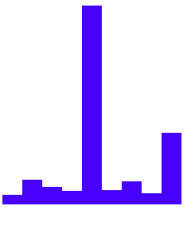
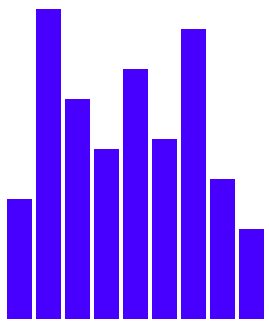

# Data Visualization with D3


* D3 is a JavaScript library that can be used to create visualizations in the browser.

* Takes input data and maps it into a visual representation of that data
* Lets you attach the data to the DOM
* HTML or SVG elements can be used with d3's built-in methods to map that data into a visualization.


# D3 methods

select() - selects an element from the document

append() - appends an HTML node to a selected item and returns a handle to that node


text() - sets the text of the selected node or gets the current text
It can take a string or a callback function as an argument:

element.text((a) => a)

a refers to a single entry in the dataset that a selection is bound to


e.g

```HTML
<script>

d3.select("ul")
  .append("li")
  .text("D3 is cool")

  </script>
```

selectAll() - selects a group of elements and returns an array of HTML nodes for all the items in the document that match the input string


The following selects all the anchor tags in a document:
```html
const anchors = d3.selectAll("a");
```

The following example selects all lis and replaces 'Example' with 'Hi'

```html<body>
  <ul>
    <li>Example</li>
    <li>Example</li>
    <li>Example</li>
  </ul>
  <script>
   

d3.selectAll("li")
  .text("Hi")
  </script>
</body>
```

outputs:
* hi
* hi
* hi

<hr>

data() - is used on a selection of DOM elements to attach the data to those elements. Data is passed to it

enter() - is used to create a new element in the document for each piece of data in the dataset

```html
<body>
  <script>
    const dataset = [12, 31, 22, 17, 25, 18, 29, 14, 9];

    d3.select("body").selectAll("h2")
      .data(dataset)
      .enter()
      .text( (a ) => a + " pounds" );
  </script>
</body>
```

outputs: 

12 pounds
31 pounds
22 pounds
17 pounds
25 pounds
18 pounds
29 pounds
14 pounds
9 pounds

<hr>

### Inline styling with D3

* CSS inline styles can be used with D3
* Use the style() method to do so

* The following makes the output data have the font family of Dancing Script (a Google font)

```html
  .style("font-family", "verdana")
```

<hr>

## Rendering styles dynamically

```html
<body>
  <script>
    const dataset = [12, 31, 22, 17, 25, 18, 29, 14, 9];

    d3.select("body").selectAll("h2")
      .data(dataset)
      .enter()
      .append("h2")
      .text((d) => (d + " USD"))
      .style("color", (d) => d < 20 ? "red" : "green")
  </script>
</body>
```
Renders 12, 17, 18, 14, 9 red
and the others green, using the style() method and the ternary operator

<hr>

### Add classes to elements for styling purposes

The attr() method can be used for this purpose:


```html
<style>
  .bar {
    width: 25px;
    height: 100px;
    display: inline-block;
    background-color: blue;
  }
</style>
<body>
  <script>
    const dataset = [12, 31, 22, 17, 25, 18, 29, 14, 9];

    d3.select("body").selectAll("div")
      .data(dataset)
      .enter()
      .append("div")
      .attr("class", "bar")
  </script>
</body>
```

* Gives the dataset a class of "bar" 
* Renders a blue box


# Rendering data as a bar chart

```html
<style>
  .bar {
    width: 25px;
    height: 100px;
    display: inline-block;
    background-color: blue;
  }
</style>
<body>
  <script>
    const dataset = [12, 31, 22, 17, 250, 18, 29, 14, 90];

    d3.select("body").selectAll("div")
      .data(dataset)
      .enter()
      .append("div")
      .attr("class", "bar")
      .style("height", (d) => d)
  </script>
</body>
```

Renders:



# Bar chart with spacing

```html
<style>
  .bar {
    width: 25px;
    height: 100px;
    margin: 2px;
    display: inline-block;
    background-color: blue;
  }
</style>
<body>
  <script>
    const dataset = [12, 31, 22, 17, 25, 18, 29, 14, 9];

    d3.select("body").selectAll("div")
      .data(dataset)
      .enter()
      .append("div")
      .attr("class", "bar")
      .style("height", ( d) => (10 * d + "px"))
  </script>
</body>
```
The margin adds spacing between the columns
The callback can be modified to increase the height

Renders:


<hr>

### SVG - Scalable Vector Graphics

```html
<style>
  svg {
    background-color: pink;
   
  }
</style>
<body>
  <script>
    const dataset = [12, 31, 22, 17, 25, 18, 29, 14, 9];

    const w = 500;
    const h = 100;

    const svg = d3.select("body")
                  // Add your code below this line

   .append("svg")
    .style("height", "h")
    .style("width", "w")

  </script>
</body>
```

Renders:


<hr>

### Rendering shapes with SVG

Adding a rect shap to the svg, with a width of 25, height of 100, x and y coordinates both 0

```html
<body>
  <script>
    const dataset = [12, 31, 22, 17, 25, 18, 29, 14, 9];

    const w = 500;
    const h = 100;

    const svg = d3.select("body")
                  .append("svg")
                  .attr("width", w)
                  .attr("height",  h)
                 
                 svg.append("rect")
                    .attr("x", 0)
                    .attr("y", 0)
                    .attr("width", 25)
                    .attr("height", 100);

  </script>
</body>
```

Renders:


<hr>

```
<body>
  <script>
    const dataset = [12, 31, 22, 17, 25, 18, 29, 14, 9];

    const w = 500;
    const h = 100;

    const svg = d3.select("body")
                  .append("svg")
                  .attr("width", w)
                  .attr("height", h);

    svg.selectAll("rect")
       .data(dataset)
       .enter()
       .append('rect')

       .attr("x", 0)
       .attr("y", 0)
       .attr("width", 25)
       .attr("height", 100);
  </script>
</body>
```

Renders:


<hr>